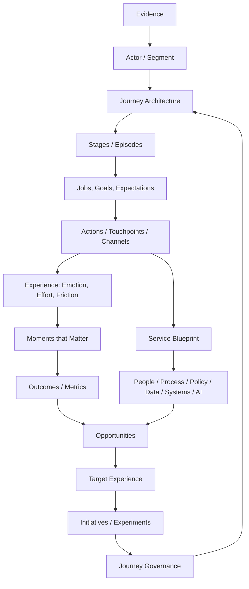

# Journey Architecture OS

[](https://github.com/almazrobots/journey-architecture-os/actions/workflows/validate.yml)
[](LICENSE)

**Journey Architecture OS is an open operating system for designing, measuring, and managing customer and employee journeys.**

It covers Customer Journey Mapping (CJM), Employee Journey Mapping (EJM), service design, journey management, governance, metrics, and portfolio management, and ships as 15 vendor-neutral [Agent Skills](https://agentskills.io/specification) that AI agents and human practitioners can use.

The goal is to move beyond "drawing a journey map" toward a repeatable operating system:

**evidence → journey architecture → current state → service system → moments that matter → metrics → opportunities → target experience → governance → portfolio management**

## Why this repository exists

Most journey-mapping work fails for predictable reasons:

- maps are built from internal assumptions and presented as customer truth;
- a single flat map is stretched across an entire lifecycle;
- customer-facing experience is disconnected from backstage operations;
- emotions are invented instead of evidenced;
- opportunities are not linked to root causes, owners, metrics, or initiatives;
- maps become static workshop artifacts with no review cadence;
- employee journeys and customer journeys are managed separately even when they share the same service system.

Journey Architecture OS treats maps as **models and operating artifacts**, not posters.

## Core model



## Skills

| Skill | Use it for |
|---|---|
| `experience-architecture` | Orchestrate the full suite and choose the right sequence of methods |
| `journey-architecture` | Define hierarchy, scope, IDs, actors, boundaries, and relationships across journeys |
| `journey-research` | Build and synthesize journey evidence without confusing assumptions with findings |
| `customer-journey-mapping` | Create evidence-backed current-state or future-state CJMs |
| `employee-journey-mapping` | Create EJM across employee lifecycle, work episodes, and enabling environments |
| `jobs-and-outcomes` | Frame actor goals, jobs, desired outcomes, and success criteria |
| `service-blueprinting` | Connect frontstage experience to backstage people, process, policy, data, systems, and AI |
| `moments-that-matter` | Identify and validate disproportionately important moments |
| `journey-metrics` | Build stage-level measurement trees and experience/behavior/operations/business metrics |
| `experience-opportunity-prioritization` | Convert evidence into opportunity areas and prioritized change hypotheses |
| `target-experience-design` | Design future-state experience principles, scenarios, and transition states |
| `journey-governance` | Define owners, lifecycle, evidence freshness, review cadence, and change control |
| `journey-portfolio-management` | Manage a journey atlas/portfolio across products, channels, teams, and actors |
| `journey-workshop-facilitation` | Plan and facilitate cross-functional journey workshops without turning opinions into facts |
| `journey-quality-audit` | Audit maps, blueprints, and journey programs for evidence, coherence, actionability, and governance |

## Installation

Install all skills into a vendor-neutral Agent Skills directory:

```bash
python3 scripts/install_skills.py --all --target .agents/skills
```

Install only selected skills:

```bash
python3 scripts/install_skills.py \
  --skill journey-architecture \
  --skill customer-journey-mapping \
  --skill service-blueprinting \
  --target .agents/skills
```

List available skills:

```bash
python3 scripts/install_skills.py --list
```

You can also copy any directory under `skills/` into the skills location supported by your agent client.

## Suggested entry points

For a broad or ambiguous request, start with `experience-architecture`.

### "Build a CJM"
Use:

1. `journey-architecture`
2. `journey-research`
3. `jobs-and-outcomes`
4. `customer-journey-mapping`
5. `moments-that-matter`
6. `journey-metrics`
7. `experience-opportunity-prioritization`

Add `service-blueprinting` when delivery mechanics matter.

### "Build an EJM"
Use:

1. `journey-architecture`
2. `journey-research`
3. `employee-journey-mapping`
4. `moments-that-matter`
5. `service-blueprinting`
6. `journey-metrics`

### "Create enterprise journey management"
Use:

1. `journey-architecture`
2. `journey-governance`
3. `journey-portfolio-management`
4. `journey-metrics`
5. `journey-quality-audit`

## JourneyOps: the operational layer

A map is only useful while it stays current. **JourneyOps** is the part of Journey Architecture OS that keeps journeys running after the mapping work ends: owners, versions, evidence freshness, review cadence, stage-level metrics, and links from opportunities to initiatives across the whole portfolio.

In this repository JourneyOps is `journey-governance` + `journey-metrics` + `journey-portfolio-management`, with `journey-quality-audit` as the health check.

## Evidence discipline

Every important journey claim should carry a provenance status:

- **Observed** — directly supported by a source or measurement.
- **Inferred** — reasoned from multiple observations; inference is explicit.
- **Hypothesis** — plausible but not yet validated.
- **Unknown** — important gap that must not be silently filled.

A polished-looking map with unsupported content is lower quality than an incomplete map that shows its unknowns.

## Journey hierarchy

This repository uses a flexible hierarchy rather than one universal "correct" journey size:

- **L0 — Experience domain / portfolio**: e.g. "Customer relationship"
- **L1 — Lifecycle**: e.g. "Become and remain a customer"
- **L2 — Journey**: e.g. "Start using the service"
- **L3 — Episode**: e.g. "Verify identity"
- **L4 — Interaction / touchpoint**: e.g. "Upload ID in mobile app"

The labels can be adapted, but the hierarchy must remain explicit.

## Design principles

1. Start with the actor's goal, not the organization's process.
2. Separate evidence from assumptions.
3. Model the end-to-end experience before optimizing a channel.
4. Treat nonlinearity as real; do not force every journey into a funnel.
5. Map backstage delivery only after the actor-facing experience is clear.
6. Use emotion only when it is grounded in evidence or clearly marked as a hypothesis.
7. Tie every priority opportunity to evidence, an outcome, and an owner.
8. Treat employee and customer experience as connected systems where appropriate.
9. Give journeys stable identities and version history.
10. Keep maps alive through governance, metrics, and recurring review.

## Standards compatibility

Each skill follows the Agent Skills format: a skill directory contains a `SKILL.md` with YAML frontmatter and may include `references/` and `assets/`. Main skill files are deliberately compact; deeper material is loaded progressively.

Validate the repository:

```bash
python3 scripts/validate_repo.py
python3 -m unittest discover -s tests
```

## Repository map

```text
journey-architecture-os/
├── README.md
├── README.ru.md
├── AGENTS.md
├── LICENSE
├── CHANGELOG.md
├── CONTRIBUTING.md
├── CODE_OF_CONDUCT.md
├── SECURITY.md
├── Makefile
├── skills.json            # machine-readable skill registry
├── docs/                  # methodology, data model, glossary, adoption guide, anti-patterns
├── examples/              # fictional CJM, EJM, and portfolio examples
├── skills/                # 15 Agent Skills (SKILL.md + references/ + assets/)
├── scripts/               # install_skills.py, validate_repo.py
├── tests/
└── .github/workflows/validate.yml
```

## Intellectual lineage

The repository is original synthesis, not a reproduction of any proprietary framework. It is informed by established work in experience mapping, service design, customer experience, employee experience, and journey management. See [`docs/bibliography.md`](docs/bibliography.md) and [`docs/intellectual-lineage.md`](docs/intellectual-lineage.md).

## License

MIT. See `LICENSE`.
