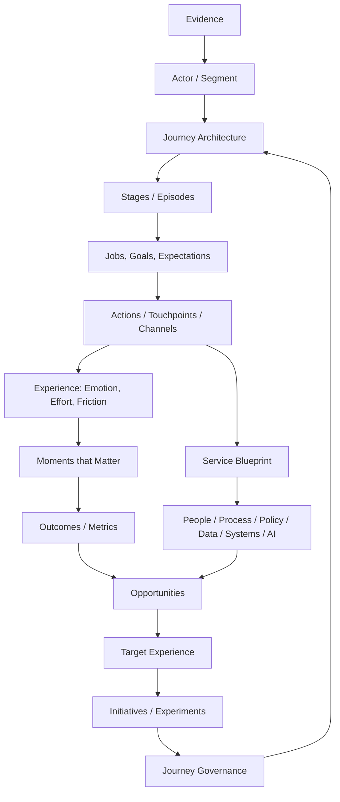

# Journey Architecture OS

[](https://github.com/almazrobots/journey-architecture-os/actions/workflows/validate.yml)
[](LICENSE)

**Journey Architecture OS is an open operating system for designing, measuring, and managing customer and employee journeys.**

It covers customer journey mapping (CJM), employee journey mapping (EJM), service blueprinting, moments that matter, journey metrics, opportunity prioritization, target-state design, governance, and portfolio management. It ships as 15 vendor-neutral [Agent Skills](https://agentskills.io/specification) that an AI agent loads on demand and a practitioner can read as a method.

**evidence → journey architecture → current state → service system → moments that matter → metrics → opportunities → target experience → governance → portfolio**

## What is inside

| Layer | What it gives you |
|---|---|
| **Skills** (`skills/`) | 15 skills, each a compact `SKILL.md` with a workflow, output contract, and quality gates |
| **Methods** (`skills/*/references/`) | 21 method guides, at least one per skill: synthesis to stages, root-cause analysis, metric trees and noise, moment analysis, prioritization, jobs and outcomes, experiment design, target-state design, audit rubric, governance, facilitation, portfolio health, research ethics, and more |
| **Contract** | One ontology (IDs, enumerations, referential rules), 13 CSV registers, and a JSON Schema for each register row |
| **Worked example** | [`examples/saas-onboarding/`](examples/saas-onboarding/): one fictional journey system taken from evidence to funded initiatives, every link stored as data |
| **Quality** | A strict validator (331 tests, 99.4% mutation score) and model evals for skill routing and behavior |

## Quick start

Install the skills into your agent's skills directory:

```bash
python3 scripts/install_skills.py --all --target .agents/skills     # all skills
python3 scripts/install_skills.py --list                            # see what is available
```

Or copy any directory under `skills/` to wherever your agent client loads skills from. Each skill is self-contained: it carries its own `references/conventions.md` with the ID grammar, evidence statuses, and the register columns it uses.

Then ask your agent something like:

- "Here are 12 interview notes and our support-ticket export for the returns journey. Turn them into something we can plan from."
- "Our new hires can't do real work for three weeks. Map what happens and why."
- "We have 40 journey maps from different teams. Which ones should leadership look at?"

For a broad or ambiguous request, start with `experience-architecture`; it picks the smallest set of skills for the decision at hand.

## Why this exists

Most journey-mapping work fails for predictable reasons:

- maps are built from internal assumptions and presented as customer truth;
- one flat map is stretched across an entire lifecycle;
- the customer-facing experience is disconnected from the backstage operations that produce it;
- emotions are drawn instead of evidenced;
- opportunities are features in disguise, with no root cause, owner, or metric;
- maps become workshop posters with no owner or review cadence;
- employee and customer journeys are managed separately even when one service system produces both.

Journey Architecture OS treats a map as a view over a model: every claim carries an evidence status, every entity has a stable ID, and every link from evidence to initiative is stored as data that can be checked.

## Core model



## Skills

| Skill | Use it for | Method guide |
|---|---|---|
| `experience-architecture` | Choosing and sequencing methods for a broad or cross-functional request | operating model |
| `journey-architecture` | Hierarchy, scope, IDs, actors, boundaries, and relations between journeys | ontology, decomposition |
| `journey-research` | Planning, gathering, and synthesizing evidence without passing assumptions off as findings | synthesis to stages, research ethics |
| `customer-journey-mapping` | Evidence-backed current-, target-, or transitional-state CJMs | map types |
| `employee-journey-mapping` | EJMs across lifecycle events and real work episodes | employee lenses, employee research ethics |
| `jobs-and-outcomes` | Jobs, desired outcomes, and success criteria independent of solutions | jobs method |
| `service-blueprinting` | Linking the actor's experience to frontstage, backstage, policy, data, systems, and AI | root-cause analysis, blueprint layers |
| `moments-that-matter` | Showing which moments have disproportionate consequences | moment analysis |
| `journey-metrics` | Metric trees from actor outcome to drivers and guardrails | metric-tree method |
| `experience-opportunity-prioritization` | Solution-independent opportunities and defensible priorities | prioritization method |
| `target-experience-design` | Target and transitional states, principles, and experiments | target-state design, experiment design |
| `journey-governance` | Owners, review cadence, evidence freshness, and change control | governance method |
| `journey-portfolio-management` | Managing many journeys as one portfolio | portfolio health |
| `journey-workshop-facilitation` | Workshops that produce hypotheses and decisions, not fake research | facilitation method |
| `journey-quality-audit` | Auditing a map, blueprint, or journey program and routing the repairs | audit rubric |

Typical sequences:

- **Build a CJM:** `journey-architecture` → `journey-research` → `jobs-and-outcomes` → `customer-journey-mapping` → `moments-that-matter` → `journey-metrics` → `experience-opportunity-prioritization`; add `service-blueprinting` when delivery mechanics matter.
- **Build an EJM:** `journey-architecture` → `journey-research` → `employee-journey-mapping` → `moments-that-matter` → `service-blueprinting` → `journey-metrics`.
- **Run journeys as an enterprise system:** `journey-architecture` → `journey-governance` → `journey-portfolio-management` → `journey-metrics` → `journey-quality-audit`.

[`docs/skill-map.md`](docs/skill-map.md) routes common requests to skills and shows which skill writes and reads which register.

## Evidence discipline

Every material claim carries one of four statuses:

| Status | Meaning |
|---|---|
| `observed` | Directly supported by a cited source or measurement; cites at least one observed evidence item |
| `inferred` | Reasoned from evidence, with the reasoning stated; cites the evidence it rests on |
| `hypothesis` | Plausible, not yet validated. Stakeholder opinion never rises above this |
| `unknown` | A material question with no adequate evidence, registered rather than filled in |

A polished map with unsupported content is worse than an incomplete map that shows its unknowns.

## Journey hierarchy

| Level | Entity | Example |
|---|---|---|
| L0 | Experience domain | Customer relationship |
| L1 | Lifecycle | Become and remain a customer |
| L2 | Journey | Start using the service |
| L3 | Stage | Verify identity |
| L4 | Episode, step, or interaction | Upload an ID document in the app |

Current, target, and transitional versions of a journey are separate L2 journeys linked by `baseline_journey_id`. Branches, loops, and channel switches are modeled, not flattened.

## JourneyOps: the operational layer

A map is useful only while it stays current. **JourneyOps** keeps journeys running after the mapping work ends: an accountable owner, versioned changes with reasons and approvers, evidence freshness rules, review triggers, stage-level metrics, and opportunity-to-initiative links across the portfolio. It is implemented by `journey-governance`, `journey-metrics`, and `journey-portfolio-management`, with `journey-quality-audit` as the recurring health check.

## The worked example

[`examples/saas-onboarding/`](examples/saas-onboarding/) models "Ledgerly", a fictional invoicing product whose new customer admins stall between contract and first team-wide use. It contains all 13 registers and the views built on them: current-state CJM, service blueprint with root-cause trees, moments that matter, metric tree, opportunities, target and transitional journeys, governance, a statistics appendix, and a self-audit that names the example's own weaknesses. Start with its [README](examples/saas-onboarding/README.md), which traces opportunities from evidence to funded initiatives by ID.

## Quality

```bash
make validate       # skills, contract, schemas, and every example journey system
make test           # unit tests
make mutation       # mutation testing of the validator (local only)
make evals-check    # structural check of the eval files, no model calls
make conventions    # regenerate each skill's references/conventions.md from the ontology
```

- **Validation.** The standard-library validator (Python 3.9+) enforces the ontology on every register row: ID grammar, enumerations, referential integrity, evidence rules, node depth, version links, metric-tree roots and acyclicity, portfolio ownership, and header-only templates. It also checks skill packaging: strict frontmatter, no references outside a skill, no symlinks, and conventions cards in sync with the ontology. Details: [`docs/validation.md`](docs/validation.md).
- **Evaluations.** {{EVALS}} Method, cost, and limits: [`docs/evaluations.md`](docs/evaluations.md). Raw results: [`evals/results/`](evals/results/).

## Design principles

1. Start with the actor's goal, not the organization's process.
2. Separate evidence from assumptions.
3. Model the end-to-end experience before optimizing a channel.
4. Treat nonlinearity as real; do not force every journey into a funnel.
5. Map backstage delivery only after the actor-facing experience is clear.
6. Use emotion only when it is grounded in evidence or clearly marked as a hypothesis.
7. Tie every priority opportunity to evidence, an outcome, and an owner.
8. Treat employee and customer experience as connected systems where appropriate.
9. Give journeys stable identities and version history.
10. Keep maps alive through governance, metrics, and recurring review.

## Repository map

```text
journey-architecture-os/
├── skills/                # 15 Agent Skills: SKILL.md + references/ + assets/
├── schemas/               # JSON Schema for one row of each register
├── examples/              # flagship journey system (saas-onboarding/) and smaller examples
├── evals/                 # routing and behavior evals, distractor skills, committed results
├── docs/                  # methodology, data model, glossary, validation, evaluations, adoption, anti-patterns, bibliography
├── scripts/               # install_skills, validate_repo, sync_conventions, mutation_test, run_evals
├── tests/                 # unit tests; fixtures/minimal-system is a small valid journey system
├── skills.json            # machine-readable skill registry
├── AGENTS.md              # rules for agents and contributors working on this repo
└── Makefile
```

## Contributing and lineage

See [`CONTRIBUTING.md`](CONTRIBUTING.md) and [`AGENTS.md`](AGENTS.md). The ontology is the contract: a change to a register starts there. Security reports: [`SECURITY.md`](SECURITY.md).

This is original synthesis, not a reproduction of any proprietary framework. It draws on work in experience mapping, service design, jobs-to-be-done, qualitative research, measurement, and employee experience; see [`docs/intellectual-lineage.md`](docs/intellectual-lineage.md) and [`docs/bibliography.md`](docs/bibliography.md).

Русская версия: [`README.ru.md`](README.ru.md).

## License

MIT. See [`LICENSE`](LICENSE).
