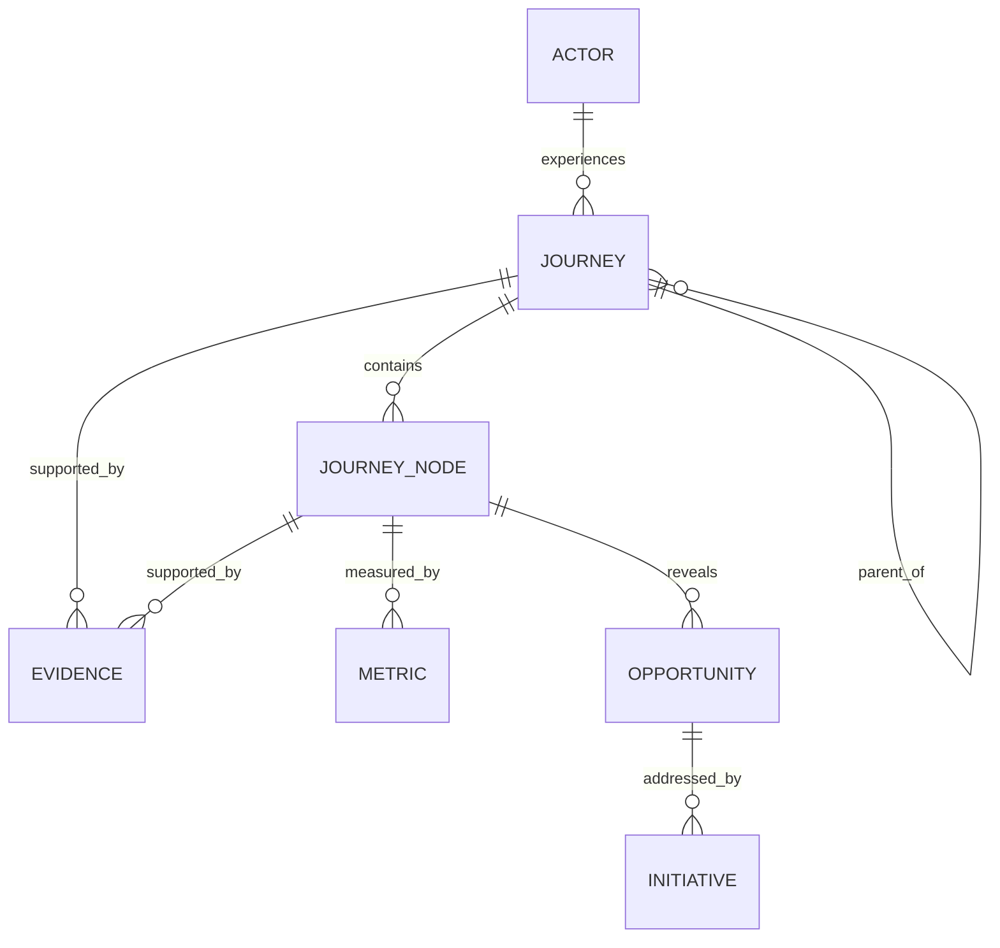

# Canonical data model

The repository is intentionally tool-agnostic. This model can live in a spreadsheet, database, graph, service-design platform, or custom application.

## Core entities

### Actor
- `actor_id`
- `name`
- `type`: customer, employee, partner, citizen, manager, candidate, etc.
- `segment`
- `context`
- `needs`
- `constraints`

### Journey
- `journey_id`
- `name`
- `level`
- `actor_id`
- `purpose`
- `trigger`
- `start_boundary`
- `end_boundary`
- `state`: current, target, transitional
- `status`: draft, validated, active, stale, archived
- `owner`
- `version`
- `last_reviewed_at`
- `evidence_freshness`
- `parent_journey_id`

### Stage / Episode / Interaction
- `node_id`
- `journey_id`
- `parent_node_id`
- `sequence_or_graph_position`
- `name`
- `goal`
- `job`
- `expected_outcome`
- `actions`
- `touchpoints`
- `channels`
- `experience_signals`
- `frictions`
- `workarounds`

### Evidence
- `evidence_id`
- `source_type`
- `source_reference`
- `collected_at`
- `population_or_sample`
- `finding`
- `status`: observed, inferred, hypothesis, unknown
- `confidence_note`
- `limitations`

### Metric
- `metric_id`
- `name`
- `type`
- `definition`
- `journey_or_node_id`
- `direction`
- `source`
- `owner`
- `cadence`
- `baseline`
- `target`
- `guardrail`

### Opportunity
- `opportunity_id`
- `problem_or_need`
- `evidence_ids`
- `journey_or_node_id`
- `affected_actor`
- `desired_outcome`
- `root_cause`
- `priority_rationale`
- `owner`
- `status`

### Initiative / Experiment
- `initiative_id`
- `opportunity_ids`
- `hypothesis`
- `change`
- `expected_metric_effect`
- `dependencies`
- `owner`
- `status`

## Relationships

## Stable IDs

Use IDs that survive renaming. Recommended patterns:

- `ACT-CUST-SMB-01`
- `JRN-CUST-ONBOARD-001`
- `JRN-EMP-ACCESS-001`
- `STG-JRN-CUST-ONBOARD-001-03`
- `EVD-2026-0042`
- `OPP-0081`

Do not encode volatile organizational ownership into the ID.
