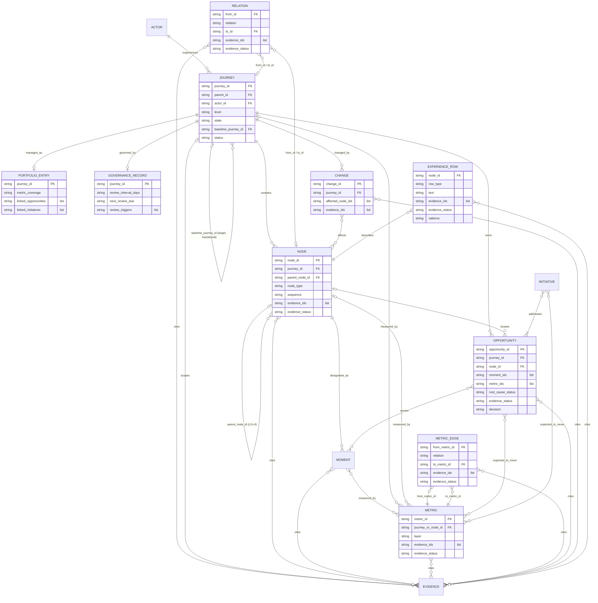

# Data model

The canonical definition of every entity, ID pattern, enumeration, register column, and referential rule is [`skills/journey-architecture/references/ontology.md`](../skills/journey-architecture/references/ontology.md). This page explains the model; where the two differ, the ontology wins.

The model is tool-agnostic. It can live in spreadsheets, a relational database, a graph store, or a service-design platform, provided the IDs and columns survive the move.

## Principle: registers hold the facts, artifacts are views

A journey system is a set of CSV registers linked by stable IDs. A customer journey map, employee journey map, service blueprint, metric tree, or portfolio dashboard is a view over those registers: it cites IDs and adds narrative, but it does not own the data. This is what lets a map be redrawn, a stage renamed, or a team reorganized without losing evidence, metrics, or decisions.

## Entities and registers

| Entity | ID pattern | Register (skill that owns the template) | What a row asserts |
|---|---|---|---|
| Actor | `ACT-{ACTOR}-{SLUG}-{NN}` | `actor-register.csv` (journey-architecture) | A person or role whose experience is modeled, with the context that changes their behavior |
| Domain (L0), lifecycle (L1), journey (L2) | `DOM-…-{NNN}`, `LFC-{ACTOR}-…-{NNN}`, `JRN-{ACTOR}-…-{NNN}` | `journey-registry.csv` (journey-architecture) | A bounded unit of actor progress with trigger, boundaries, desired outcome, state, baseline version, status, and owner |
| Relation | keyed by `from_id, relation, to_id` | `relation-register.csv` (journey-architecture) | A lateral relationship between two hierarchy entries or nodes, such as `precedes`, `depends_on`, or `enables`, with its evidence |
| Node: stage (L3), episode, step, or interaction (L4) | `NOD-{JOURNEY_KEY}-{NN}[-{NN}…]` | `node-register.csv` (journey-architecture) | A position inside one journey; depth fixes the level and whether it is a stage |
| Evidence | `EVD-{YYYY}-{NNNN}` | `evidence-register.csv` (journey-research) | One source-backed finding with population, date, and limitations, or a registered evidence gap (`unknown`) |
| Moment that matters | `MTM-{NNNN}` | `moment-register.csv` (moments-that-matter) | A node whose quality has disproportionate consequence, and why |
| Metric | `MET-{NNNN}` | `metric-register.csv` (journey-metrics) | A defined measurement attached to a node, a journey, or (for business outcomes) a lifecycle or domain, with the evidence that it measures what it claims |
| Metric edge | keyed by `from_metric_id, relation, to_metric_id` | `metric-edge-register.csv` (journey-metrics) | A causal claim that one metric `drives` another, or that a guardrail `protects` another |
| Opportunity | `OPP-{NNNN}` | `opportunity-register.csv` (experience-opportunity-prioritization) | A solution-independent problem in one primary journey, its root cause with a separate status, the moments it serves, and the decision taken |
| Initiative / experiment | `INI-{NNNN}` | `initiative-register.csv` (target-experience-design) | A change that addresses one or more opportunities and is expected to move named metrics |
| Portfolio entry | keyed by `journey_id` | `portfolio-register.csv` (journey-portfolio-management) | Management metadata for one hierarchy entry: freshness, metric coverage, and the opportunities and initiatives of its own journeys |
| Governance record | keyed by `journey_id` | `governance-register.csv` (journey-governance) | Owner, evidence steward, metric owners, review cadence, triggers, and freshness rule |
| Experience row (optional) | keyed by `node_id, row_type, text` | `experience-register.csv` (customer-journey-mapping) | What a map shows for one node: an action, touchpoint, channel, expectation, thought, pain, workaround, emotion (with `valence` −2…2), or question, with its evidence |
| Change | `CHG-{NNNN}` | `change-log.csv` (journey-governance) | One material change to a governed journey, with reason, evidence, affected nodes, and approver |

Each register template contains the header row only; column order is fixed by the ontology. List-valued cells separate IDs with `;` and no spaces. Dates are ISO 8601 (`YYYY-MM-DD`). Empty cells mean "not yet known"; a cell holding only whitespace is invalid.

Each skill ships `references/conventions.md`, a contract card generated from the ontology with the ID grammar, the evidence statuses, and the registers that skill produces or consumes, so a skill installed on its own still carries its contract.

## Relationships

Reading the cardinalities:

- A journey has exactly one primary actor, whose actor code also appears in the journey ID; a journey involving several materially different actors is split, or modeled as linked journeys.
- Journeys, lifecycles, and domains nest through `parent_id`; nodes nest through `parent_node_id`. A node belongs to exactly one journey, and its ID embeds that journey's key. A node with no parent is a stage (L3); every node below it is L4, and its `sequence` equals its last ID segment.
- A relation joins exactly two hierarchy entries or nodes; each endpoint is one journey-registry entry or one node.
- Evidence and claims are many-to-many: one finding can support several nodes, relations, moments, metrics, metric edges, and opportunities, and one claim can cite several findings.
- A moment that matters always points to exactly one node.
- An experience row describes exactly one node. The experience register is optional; `valence` is filled on `emotion` rows only, and an `observed` or `inferred` emotion cites at least one interview, observation, diary, survey, or usability test.
- A metric attaches to exactly one node, journey, lifecycle, or domain. Each journey with metrics has one actor-outcome root metric attached to the journey itself; every other metric reaches it through `drives` edges, except business metrics (driven by the root) and guardrails (which `protect` a metric). `drives` edges form no cycle.
- An opportunity belongs to one primary journey and optionally one node; another journey reaches it through a relation, not by listing it. An initiative addresses at least one opportunity.
- A portfolio entry links only opportunities of its own journeys (for lifecycles and domains, of the journeys below them) and initiatives that address one of those.

## Referential rules

- `node_id` starts with `NOD-` followed by the key of its `journey_id`; `parent_node_id` equals the node ID minus its last `-{NN}` segment, or is empty for stages.
- Every cited ID exists in its register, including `parent_node_id`, `journey_or_node_id`, `baseline_journey_id`, `moment_ids`, `affected_node_ids`, `from_id`, `to_id`, `from_metric_id`, and `to_metric_id`.
- A parent sits at a lower level number than its child; `journey_id` prefixes follow `level` (L0 `DOM`, L1 `LFC`, L2 `JRN`).
- A row marked `observed` cites at least one `observed` evidence item; a row marked `inferred` cites at least one `observed` or `inferred` item. This covers nodes, relations, moments, metrics, metric edges, and opportunities (both `evidence_status` and `root_cause_status`).
- `stakeholder-input` evidence is `hypothesis` or `unknown`, never `inferred` or `observed`.
- A node cited together with a journey belongs to that journey.
- A portfolio row agrees with the journey registry on parent, level, actor, state, and status; a journey's `metric_coverage` equals the share of its stage-level nodes with a metric on the stage or below it, and is empty when the journey has no stages.
- Relations and metric edges never point to themselves, and each triple appears once.
- `next_review_due` is on or after `last_reviewed_at`.
- IDs never change and are never reused; retired rows are set to `archived`. IDs never encode teams, systems, vendors, or channels.
- Current, target, and transitional versions of a journey are separate journeys with separate IDs; target and transitional versions name their current journey in `baseline_journey_id`.

## Evidence status

Every row that makes a claim carries `evidence_status`: `observed`, `inferred`, `hypothesis`, or `unknown`. The status belongs to the claim, not to the source: a solid analytics export can support an `observed` drop-off and only an `inferred` reason for it. On a metric row the status is about the measure's validity; the causal claim between two metrics is a metric edge with its own status.

## Examples

| Entity | Example ID |
|---|---|
| Actor | `ACT-CUST-SHOP-OWNER-01` |
| Domain | `DOM-CUSTOMER-LIFE-001` |
| Lifecycle | `LFC-CUST-SHOP-LIFE-001` |
| Journey | `JRN-CUST-SHOP-SETUP-001` |
| Node | `NOD-CUST-SHOP-SETUP-001-03` (stage 3), `NOD-CUST-SHOP-SETUP-001-03-02` (episode 2 of stage 3) |
| Evidence | `EVD-2025-0942` |
| Moment | `MTM-0903` |
| Metric | `MET-0912` |
| Opportunity | `OPP-0981` |
| Initiative | `INI-0907` |
| Change | `CHG-0904` |

Required columns per register are enforced by the JSON Schemas in `schemas/` and checked by `scripts/validate_repo.py`.
