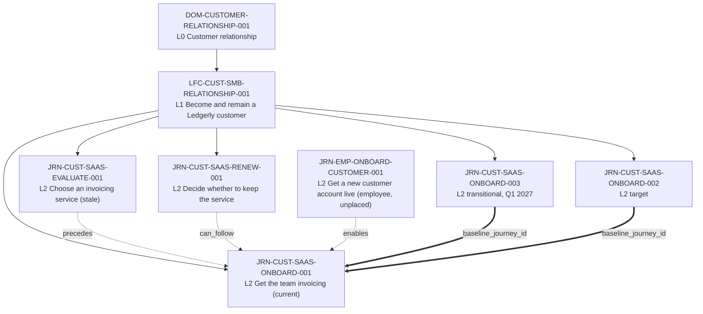
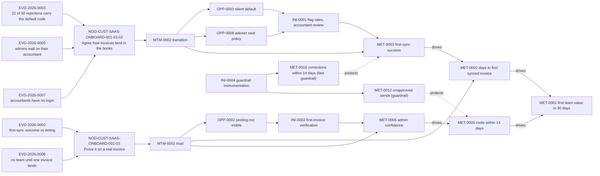

# Worked example: getting a new SaaS customer's team invoicing

> **Fictional example.** Ledgerly, its customers, staff, numbers, interviews and quotes are invented to show the method. Nothing here is research evidence about any real product or market, and Ledgerly is not modeled on a real company.

One journey system built end to end with Journey Architecture OS, from evidence to a funding recommendation, joined by stable IDs across 13 registers plus the optional experience register.

## The situation and the decision

Ledgerly sells an invoicing service to small businesses (3–50 staff). New accounts sign, the admin logs in, and then many stall between contract signature and the whole team invoicing in the product. 34% of new accounts meet the first-team-value threshold within 30 days (`MET-0001`, source `EVD-2026-0001`).

**Decision this example supports:** which 2–3 changes to fund next quarter (Q1 2027) to raise the share of new accounts reaching first team value within 30 days of signature.

**Recommendation:** fund `INI-0004` (guardrail instrumentation) now, then build:

- `INI-0001`, which flags unmatched rates. It ships only to the two ledgers with a change feed, once the fast guardrail `MET-0016` has a baseline (due 2026-12-07).
- `INI-0002`, first-invoice verification, as a randomized rollout.

`INI-0003` is held as a harm-screening pilot that cannot demonstrate safety. No opportunity is `act-now`: every change waits on a guardrail baseline. Reasoning in [opportunities.md](opportunities.md); arithmetic in [stats.md](stats.md).

## How to read it

Views cite register IDs; when a view and a register disagree, the register wins.

| # | File | Skill | What it answers |
|---|---|---|---|
| 1 | [engagement-brief.md](engagement-brief.md) | `experience-architecture` | Decision, actor, scope, definition of done |
| 2 | [journey-registry.csv](journey-registry.csv), [actor-register.csv](actor-register.csv), [relation-register.csv](relation-register.csv) | `journey-architecture` | Where the journey sits, its versions and neighbours, who the actors are |
| 3 | [evidence-register.csv](evidence-register.csv) | `journey-research` | What is known, from which source, with what limits |
| 4 | [current-state-cjm.md](current-state-cjm.md) + [node-register.csv](node-register.csv) + [experience-register.csv](experience-register.csv) | `customer-journey-mapping` | What admins do, think and feel today, stage by stage, and how firm each claim is |
| 5 | [service-blueprint.md](service-blueprint.md) | `service-blueprinting` | How the critical episode is produced, and two root-cause trees |
| 6 | [moments-that-matter.md](moments-that-matter.md) + [moment-register.csv](moment-register.csv) | `moments-that-matter` | Which three moments carry disproportionate consequence |
| 7 | [metric-tree.md](metric-tree.md) + [metric-register.csv](metric-register.csv) + [metric-edge-register.csv](metric-edge-register.csv) | `journey-metrics` | What is measured, how valid each measure is, and which causal links are assumptions |
| 8 | [opportunities.md](opportunities.md) + [opportunity-register.csv](opportunity-register.csv) | `experience-opportunity-prioritization` | One opportunity per root cause; what to fund and what not |
| 9 | [target-state-journey.md](target-state-journey.md) + [initiative-register.csv](initiative-register.csv) | `target-experience-design` | Target and transitional journeys, experiments |
| 10 | [governance.md](governance.md) + [governance-register.csv](governance-register.csv) + [change-log.csv](change-log.csv) + [portfolio-register.csv](portfolio-register.csv) | `journey-governance`, `journey-portfolio-management` | Ownership, cadence, triggers, change history, portfolio entry |
| 11 | [stats.md](stats.md) | — | Intervals, detectable effects, sample sizes |
| 12 | [quality-audit.md](quality-audit.md) | `journey-quality-audit` | Where this example is still weak |

Pattern B, root-cause redesign: `journey-research → customer-journey-mapping → service-blueprinting → journey-metrics → experience-opportunity-prioritization → target-experience-design`, then governance and the portfolio entry.

## Journey hierarchy

Solid arrows are `parent_id` in [journey-registry.csv](journey-registry.csv). Dotted arrows are rows of [relation-register.csv](relation-register.csv), read "from `relation` to"; that register also holds two node-level `depends_on` rows. Thick arrows are `baseline_journey_id`. Only `JRN-CUST-SAAS-ONBOARD-001` and its versions are modeled in depth; the others are portfolio entries so that dependencies and staleness stay visible.

## How IDs flow from evidence to funded change

Every arrow in this diagram is a cell in a register. The self-check behind this example reads the diagram and fails if any arrow is not one of these links:

| Arrow | Register column |
|---|---|
| evidence → node | `evidence_ids` in node-register |
| node → moment | `node_id` in moment-register |
| moment → metric | `metric_ids` in moment-register |
| metric → metric | a `drives` or `protects` row in metric-edge-register |
| moment → opportunity | `moment_ids` in opportunity-register |
| node → opportunity | `node_id` in opportunity-register |
| opportunity → initiative | `opportunity_ids` in initiative-register |
| initiative → metric | `expected_metric_ids` in initiative-register |

<!-- chain -->

## Trace table

| Root cause (tree in [service-blueprint.md](service-blueprint.md)) | Opportunity | Evidence | Node | Moment | Metrics | Decision | Initiative |
|---|---|---|---|---|---|---|---|
| Auto-matcher silently defaults unmatched tax rates (`observed`, mechanism trace) | `OPP-0001` | `EVD-2026-0003` | `NOD-CUST-SAAS-ONBOARD-001-02-02` | `MTM-0002`, `MTM-0001` | `MET-0003`, `MET-0002`; guardrails `MET-0016`, `MET-0011` | sequence | `INI-0001`, after `INI-0004` |
| Adviser login costs a paid seat, so the accountant answers without access or context (`inferred`) | `OPP-0008` | `EVD-2026-0003`, `EVD-2026-0005`, `EVD-2026-0007`, `EVD-2026-0010`, `EVD-2026-0017` | `NOD-CUST-SAAS-ONBOARD-001-02-02` | `MTM-0002` | `MET-0015`, `MET-0003`, `MET-0008` | investigate (segment unsized) | `INI-0001` prototype |
| No record or owner for an open mapping question (`hypothesis`, RACI check pending) | `OPP-0009` | `EVD-2026-0005`, `EVD-2026-0003` | `NOD-CUST-SAAS-ONBOARD-001-02-02` | `MTM-0002` | `MET-0015` | investigate | `INI-0001` (event trail) |
| Posting result never shown to the admin (`inferred`) | `OPP-0002` | `EVD-2026-0006`, `EVD-2026-0003`, `EVD-2026-0008` | `NOD-CUST-SAAS-ONBOARD-001-03` | `MTM-0001` | `MET-0006`, `MET-0005`; guardrail `MET-0012` | sequence | `INI-0002` (randomized), after `INI-0004` |
| Every sent invoice posts immediately (`hypothesis`) | `OPP-0003` | `EVD-2026-0006`, `EVD-2026-0002`, `EVD-2026-0008` | `NOD-CUST-SAAS-ONBOARD-001-04` | `MTM-0001` | `MET-0001`, `MET-0005`, `MET-0002` | sequence | `INI-0004`, then `INI-0003` |
| Stakeholder claim: invites caught by spam filters | `OPP-0006` | `EVD-2026-0013`, contradicted by `EVD-2026-0008` | `NOD-CUST-SAAS-ONBOARD-001-04-02` | — | — | deprioritize | none |

The last row is kept to show a claim that did not survive contact with behavioural data.

## What this example leaves unknown

1. **Why 11% of admins do not log in within a week** (`EVD-2026-0001`). None were reached. `OPP-0007` is `investigate`; the month-end explanation (`EVD-2026-0014`) stays a stakeholder hypothesis.
2. **How large the external-accountant segment is** (`EVD-2026-0018`, a registered evidence gap). `INI-0004` adds the field.
3. **How long a mapping question waits** (`MET-0015`). Not observable in any current system.
4. **Whether team value causes retention.** `MET-0001 → MET-0009` is `inferred` on a confounded comparison (`EVD-2026-0016`).
5. **What customers call "the team is using it".** The `MET-0001` threshold is an analytics convention; its validity is `inferred`, not `observed`.
6. **Customer and item import** (`NOD-CUST-SAAS-ONBOARD-001-02-03`) is `unknown`; 9% of tickets mention it and nobody researched it.
7. **Emotion.** The experience register has 7 emotion rows and none is `observed`: five are `inferred` from interviews or the survey, and two are `hypothesis`. Stages 1 and 4 have no emotion row, so a rendered curve has gaps there instead of invented points.
8. **Guardrail baselines** (`MET-0016`, `MET-0011`, `MET-0012`, `MET-0014`) do not exist yet, and the third ledger has no change feed at all (`EVD-2026-0022`). This is why shipping waits on `INI-0004` and is limited to two ledgers.
9. **Any causal effect at all.** No `drives` edge is `observed`. The only experiment (`EVD-2026-0015`) could not detect effects under about 13 points.
10. **Whether any pilot can show safety.** At current intake, non-inferiority at 5 corrections per 1,000 needs about 790 accounts per arm, so the pilot screens only for gross harm.
11. **What the accounts that never connect a ledger do instead.** 23% of them still meet the threshold (`EVD-2026-0021`); their path is unmapped.

## Register conventions

File names and headers follow `skills/journey-architecture/references/ontology.md`. List cells use `;` without spaces; dates are ISO 8601. On a metric row `evidence_status` is the validity of the measure; causal claims between metrics live in `metric-edge-register.csv`. On an opportunity row `evidence_status` qualifies the problem (the symptom) and `root_cause_status` the cause.
