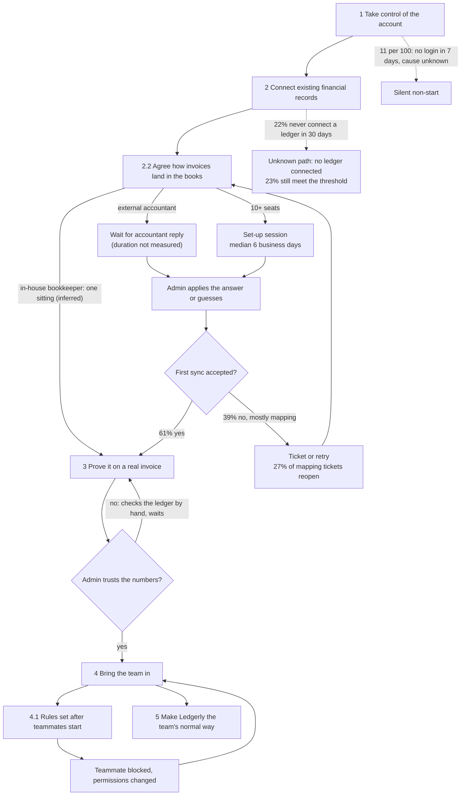

# Current-state CJM: Get the team invoicing in the service

> **Fictional example.** Ledgerly, its customers, quotes and figures are invented for illustration. Produced with `customer-journey-mapping`, with stages derived using the journey-research synthesis method. Nodes live in [node-register.csv](node-register.csv), evidence in [evidence-register.csv](evidence-register.csv).

## Journey header

| Field | Value |
|---|---|
| Journey ID | `JRN-CUST-SAAS-ONBOARD-001` (parent `LFC-CUST-SMB-RELATIONSHIP-001`) |
| Actor | Customer account admin, `ACT-CUST-SMB-ADMIN-01`; team members `ACT-CUST-SMB-TEAM-01` appear from stage 4 |
| State | Current. Nothing below describes a proposed change; see [target-state-journey.md](target-state-journey.md) |
| Trigger / start | Contract signed for a plan with 3 or more seats |
| End (actor outcome) | The team sends its real invoices through Ledgerly as its normal way of working, and the admin has stopped checking postings in the ledger by hand |
| Alternate end | The admin gives up and the team stays on the old way. Not directly observable; `MET-0001` (threshold not met by day 30, 66% of the Jan–May 2026 cohort) is the proxy |
| Measurement window | 30 days, on `MET-0001` only. The journey itself has no deadline |
| Evidence window | 2026-06-18 to 2026-09-21, plus one experiment read out on 2025-10-15 (`EVD-2026-0015`). Operational records and invite analytics are older than 60 days by the 2026-10-14 decision: needs-review until the 2026-10-07 refresh ([governance.md](governance.md)) |
| Owner / version | Director of Customer Onboarding; v1.4, 2026-09-24 (`CHG-0006`) |

## Job

When I have just signed my business up for a new invoicing service, I want my team sending real invoices through it without my books going wrong, so I can stop being the bottleneck for every invoice. Built from interviews `EVD-2026-0005` and `EVD-2026-0006`. The "bottleneck" wording came from 5 of 14 admins and describes the sample only.

## Stage model

Stages were built bottom-up from clusters of observation notes, not from team or channel names. A boundary needs at least two participants, or one participant plus a non-interview source. A stage's status is no stronger than the weakest finding that defines its goal and boundaries.

| Stage / episode | Entry → exit (actor side) | Boundary signal | Supporting clusters (sources / types) | Evidence IDs | Status | Why this status |
|---|---|---|---|---|---|---|
| 1 Take control of the account `NOD-CUST-SAAS-ONBOARD-001-01` | Contract signed → first set-up action taken | Commitment point (signature) | One cluster: early login behaviour (analytics, experiment). Goal not researched | `EVD-2026-0001`, `EVD-2026-0015`, `EVD-2026-0014` | hypothesis | Entry and exit are measured, but the actor goal rests on no finding. Kept as a stage, not merged, because it holds the unexplained 11% who never start |
| 2 Connect existing financial records `NOD-CUST-SAAS-ONBOARD-001-02` | First set-up action → the ledger accepts the first real posting | Goal change; waiting/hand-off inside | Three clusters: "I can't finish this alone" (S01–S14), "it failed and I don't know why" (support, sync log), "I'm waiting on my accountant" (interviews, observation) / 5 types | `EVD-2026-0002`, `EVD-2026-0003`, `EVD-2026-0004`, `EVD-2026-0005`, `EVD-2026-0011`, `EVD-2026-0021` | observed | Goal and both boundaries appear directly in several source types; the exit is a logged event |
| 2.1 Authorize the ledger connection `NOD-CUST-SAAS-ONBOARD-001-02-01` | — | — | Connection events only | `EVD-2026-0003` | inferred | The step is in the logs; the actor goal ("without risking existing records") is the analyst's reading, not stated by admins |
| 2.2 Agree how invoices land in the books `NOD-CUST-SAAS-ONBOARD-001-02-02` | Mapping screen reached → mapping accepted by the ledger | Waiting or hand-off (to accountant) | Converges across interview, accountant interview, observation, sync log, support log, scheduling records | `EVD-2026-0003`, `EVD-2026-0004`, `EVD-2026-0005`, `EVD-2026-0007`, `EVD-2026-0009`, `EVD-2026-0011`, `EVD-2026-0017` | observed | Strongest convergence in the study |
| 2.3 Bring in customers and items `NOD-CUST-SAAS-ONBOARD-001-02-03` | — | — | Ticket volume only | `EVD-2026-0004` | unknown | Not researched |
| 3 Prove it on a real invoice `NOD-CUST-SAAS-ONBOARD-001-03` | First posting accepted → admin trusts that one real invoice landed correctly | Knowledge threshold ("now I trust the numbers") | One interview cluster "I won't trust it until I've seen it land" (8 of 14, said + did), plus timing analytics | `EVD-2026-0006`, `EVD-2026-0002`, `EVD-2026-0021` | inferred | The threshold is stated intent from one source type; analytics show timing, not the verification behaviour itself |
| 4 Bring the team in `NOD-CUST-SAAS-ONBOARD-001-04` | Admin trusts the numbers → teammates are working in Ledgerly | Goal change (from own use to others' use) | Invite analytics; team member interviews; permission tickets; admin interviews | `EVD-2026-0006`, `EVD-2026-0008`, `EVD-2026-0019`, `EVD-2026-0020` | inferred | The goal and exit are observed in three source types, but the entry boundary is the stage-3 exit, which is placed from stated intent. A stage cannot be firmer than its weakest boundary |
| 4.1 Decide who may approve and send `NOD-CUST-SAAS-ONBOARD-001-04-01` | — | — | Team member interviews + permission tickets | `EVD-2026-0019`, `EVD-2026-0020` | observed | Two source types agree |
| 4.2 Invite teammates and hand over work `NOD-CUST-SAAS-ONBOARD-001-04-02` | — | — | Invite events | `EVD-2026-0008`, `EVD-2026-0013` (hypothesis, contradicted) | observed | Directly measured behaviour; one cluster is enough for an episode |
| 5 Make Ledgerly the team's normal way of invoicing `NOD-CUST-SAAS-ONBOARD-001-05` | Teammates working → old way dropped; admin stops checking postings by hand | Outcome reached | Team-activity analytics; admins describe hand-checking as what they do until they trust the product | `EVD-2026-0001`, `EVD-2026-0006` | inferred | Team activity is measured; that the admin stops hand-checking is the analyst's reading of what admins said they were waiting for. Not observed directly |

Only stage 2 meets the bar for `observed`: its goal and both boundaries are each supported by at least two clusters. Stages 3–5 are `inferred` because the trust boundary between stages 3 and 4 is placed from what admins said rather than from what they did. Stage 1 is `hypothesis`. To move stages to `observed`, read the model back to 3–5 admins and check that they place the same boundaries.

## Synthesis record

### Codebook (v2)

Codebook v1 was drafted by two analysts who independently coded sessions S01–S03, 146 notes in all. Cohen's κ was 0.72 (raw agreement 81%, chance agreement 32%; [stats.md](stats.md)). That checks how clear the codebook is, not whether it is true. v1 was then applied to the remaining sources.

| Code | Definition | Include | Exclude | Example note |
|---|---|---|---|---|
| waits-on-accountant | Progress stops until someone outside the business answers | Admin names a person outside the account | Waiting on a Ledgerly specialist (use `waits-on-session`) | S05-07 "sent it to Priya, heard nothing for a week" |
| waits-on-session | Progress stops until a Ledgerly session happens | Session booked or declined | Help-article reading | OS04-02 |
| cannot-tell-what-failed | Admin sees a failure but not its cause | "Sync failed" with no known reason | Failures the admin could explain | S02-11 |
| guesses-to-move-on | Admin enters a value they could not confirm | Admin says they picked "the closest" or "a default" | Values confirmed by accountant | S08-04 |
| proves-before-sharing | Admin withholds team use until one result is verified | Stated or observed hand-checking of the ledger | General caution without a verification act | S07-03 |
| rules-after-start | Approval rules set after a teammate has acted | Teammate reports a changed permission | Rules set before invites | T02-05 |
| keeps-own-books | Books kept in-house | Admin or staff member maintains the ledger | Outside firm | S11-01 |

Change log: v1 → v2 (2026-07-27) split `waits-for-help` into `waits-on-accountant` and `waits-on-session`, because the accountant wait and the session wait had different causes in the observation notes.

### Clusters

| Cluster (actor voice) | Codes | Note keys (sample) | Sources / types | Segments |
|---|---|---|---|---|
| "I can't finish this without my accountant" | waits-on-accountant, guesses-to-move-on | S01–S09 (6 of 9 stalled), OS01–OS11 (7 of 11), A01–A04 | 3 / interview, observation, accountant interview | External accountant only |
| "It failed and I don't know why" | cannot-tell-what-failed | S02, S04, S06; SL-01; OR-01, OR-02 | 3 / interview, support-log, operational-record | Both |
| "I'm waiting for a session" | waits-on-session | OS01–OS11; OR-03 | 2 / observation, operational-record | 10+ seats |
| "I won't put the team on it until one invoice lands" | proves-before-sharing | S01–S14 (8 of 14) | 1 / interview | Both |
| "My permissions changed under me" | rules-after-start | T01–T06 (4 of 6); SL-02 | 2 / interview, support-log | Accounts that met the threshold only |
| "I did the mapping in one go" | keeps-own-books | S10–S14 (5 of 5 in-house) | 1 / interview | In-house bookkeeper |

The "proves-before-sharing" cluster rests on one source type. That is why the stage 3/4 boundary it defines is `inferred`.

## Experience by stage

| Stage | What the admin does | Expectation (if researched) | Touchpoints (channel) | Friction and workarounds | Metrics | Opportunities |
|---|---|---|---|---|---|---|
| `NOD-CUST-SAAS-ONBOARD-001-01` | Opens welcome email, sets password, reads the set-up checklist | Not researched | Welcome email (email); checklist (product) | 11% have no login within 7 days; cause unknown. The 2025 checklist raised completion without a detectable outcome effect | `MET-0007` | `OPP-0007` |
| `NOD-CUST-SAAS-ONBOARD-001-02` | Connects the ledger, maps tax rates and accounts, imports lists | That set-up is something they can finish alone (5 of 14 said so) | Connection wizard, mapping screen (product); help desk (email, chat); session (video, 10+ seats) | 22% never attempt a ledger connection within 30 days | via episodes | via episodes |
| `NOD-CUST-SAAS-ONBOARD-001-02-02` | Reviews auto-matched pairs; screenshots the screen to the accountant; waits; guesses; retries | "I assumed it would pick up my tax codes" (fictional quote, S03) | Mapping screen; email outside Ledgerly; help desk; session | 125 of 321 first syncs rejected (about 30 per 100 new accounts); 22 of 30 traced rejections carried the silently defaulted code. Admins wait with no date; in 7 of 11 shadowed sessions the admin phoned the accountant mid-call. Adviser logins cost a seat. Sessions wait a median 6 business days and are declined below 10 seats | `MET-0003`, `MET-0004`, `MET-0008`, `MET-0011`, `MET-0015` | `OPP-0001`, `OPP-0008`, `OPP-0009`, `OPP-0005` |
| `NOD-CUST-SAAS-ONBOARD-001-03` | Sends one real invoice, opens the ledger, compares totals and tax by hand | "I'm not putting my team on it until I know the numbers land right" (fictional quote, S07) | Invoice editor, sync status (product); the ledger (outside Ledgerly) | Nothing in Ledgerly confirms the posting matches. Median 12 days to first synced invoice; the median is 23 days in accounts whose first sync failed and 9 where it succeeded (a difference between groups, not a measured effect) | `MET-0002`, `MET-0006` | `OPP-0002` |
| `NOD-CUST-SAAS-ONBOARD-001-04` | Sets rules, invites teammates, hands over invoices | Teammates can start straight away (not researched beyond 6 team members) | Team settings, invite email, teammates' first session | 42 per 100 new accounts send no invite within 30 days | via episodes | `OPP-0003` |
| `NOD-CUST-SAAS-ONBOARD-001-04-01` | Often sets approval rules after teammates start, then restricts permissions | — | Roles screen | 4 of 6 teammates hit an unexplained block in week 1; 61% of permission tickets raised by the teammate | `MET-0012`, `MET-0014` | `OPP-0004` |
| `NOD-CUST-SAAS-ONBOARD-001-04-02` | Sends invites | — | Invite email | 84% of sent invites accepted within 7 days; the constraint is invites not sent | `MET-0005` | `OPP-0006` (deprioritized) |
| `NOD-CUST-SAAS-ONBOARD-001-05` | Team sends real invoices; admin stops cross-checking | — | Product | 34% meet the team-value threshold within 30 days | `MET-0001` (journey level) | — |

"—" means not researched, not "no issue".

## Variations, branches and loops

| Variation | Split or variant | Defining variable | Evidence | Status |
|---|---|---|---|---|
| External accountant vs in-house bookkeeper | Variant: same goal and order, different duration | Who keeps the books | `EVD-2026-0017`; segment size unknown, `EVD-2026-0018` | inferred |
| 10+ seats vs smaller | Variant: help path differs | Seat count under the tier policy | `EVD-2026-0009`, `EVD-2026-0010` | observed |
| No ledger connection (91 of 412) | Unknown path: these accounts never reach stage 3, which depends on an accepted posting. 23% (21/91) still meet the threshold, and 38% invite someone within 30 days; how they work is unmapped | Whether a ledger is connected | `EVD-2026-0002`, `EVD-2026-0021` | unknown (path); observed (outcome) |
| Failed first-sync loop | Loop inside stage 2, not a stage (stage 2 ends only when a posting is accepted) | First-sync outcome | `EVD-2026-0003`, `EVD-2026-0004` | observed |
| Permission loop | Loop inside stage 4 | Timing of approval rules | `EVD-2026-0019`, `EVD-2026-0020` | observed |

## Contradictions

| Conflict | Sources | Pattern and decision | What would settle it |
|---|---|---|---|
| Survey says set-up is easy (71%); analytics and interviews show long stalls | `EVD-2026-0012` vs `EVD-2026-0002`, `EVD-2026-0005` | Same group, conflicting statements: survey respondents are skewed to accounts that got further (88% of respondents had sent a real invoice vs 64% of the cohort). Behavioural data preferred for what happened; the survey kept as a completer view | Survey at day 10, weighted by progress |
| Sales: teammates miss invites because of spam filters | `EVD-2026-0013` vs `EVD-2026-0008` | One stakeholder view against behavioural data: 84% of sent invites are accepted. Kept as a rejected hypothesis | Settled; re-cut invite acceptance at the 2026-10-07 refresh and reopen only if it falls below 80% |
| Support log points to technical sync errors; interviews point to waiting for a person | `EVD-2026-0003`, `EVD-2026-0004` vs `EVD-2026-0005`, `EVD-2026-0007` | Both, as parallel branches: 22 of 30 traced rejections came from the silent default, 8 from admin-edited pairs. See the root-cause tree in [service-blueprint.md](service-blueprint.md) | `MET-0015` event trail |

## Sample honesty

- 14 admin interviews: 9 from stalled accounts, 5 from successful ones, recruited by email, so non-starters are absent. There were no new interpretive codes in the last 3 stalled-admin sessions; that is a statement about this sample, not saturation.
- 4 accountants from 2 firms, 6 team members all from successful accounts, 11 sessions from 10+ seat accounts only.
- Counts from interviews ("6 of 9") describe the sample. Prevalence comes from analytics, logs or records, or is marked unknown.

## Unknowns

- Why 11% of admins do not start within a week (`EVD-2026-0001`).
- How many accounts use an external accountant (`EVD-2026-0018`).
- How long a mapping question waits (`MET-0015`).
- How the 22% who never connect a ledger work: 23% of them still meet the threshold, but their path is unmapped.
- What admins expect at stage 1, and what team members from stalled accounts experience.
- Customer and item import (`NOD-CUST-SAAS-ONBOARD-001-02-03`).

## Candidate moments that matter

Tested in [moments-that-matter.md](moments-that-matter.md): `MTM-0001` (stage 3), `MTM-0002` (episode 2.2), `MTM-0003` (episode 4.1).

## Next research questions

1. What do admins who never start say when reached by phone rather than email? (`OPP-0007`)
2. With an external accountant, how long does a mapping answer take and what does the accountant need to give it?
3. Do admins who verify the first invoice invite the team sooner, measured per account rather than stated?
4. Is the team-value threshold what admins call "working"? This decides whether stage 5 and `MET-0001` are defined correctly.

## Recommended next skill

`service-blueprinting` on `NOD-CUST-SAAS-ONBOARD-001-02-02`: [service-blueprint.md](service-blueprint.md).
