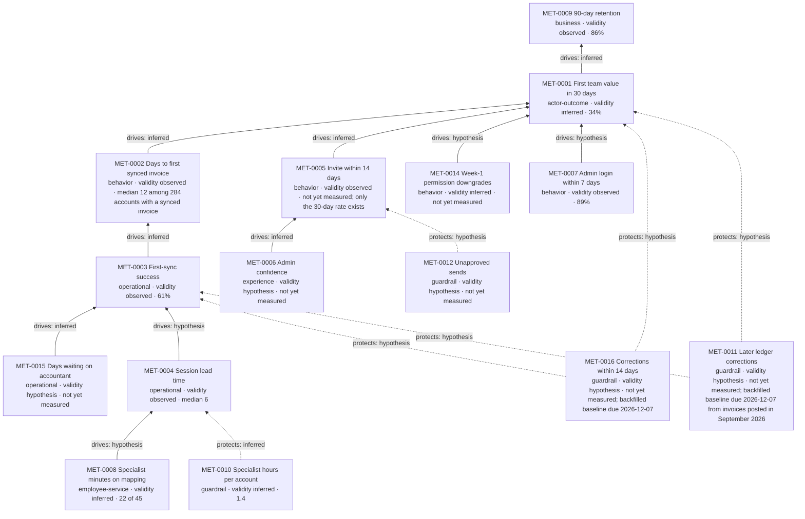

# Metric tree: Get the team invoicing in the service

> **Fictional example.** Ledgerly, its data and baselines are invented for illustration. Produced with `journey-metrics`. The tables and graph on this page are generated from [metric-register.csv](metric-register.csv) and [metric-edge-register.csv](metric-edge-register.csv); arithmetic is in [stats.md](stats.md).

Journey `JRN-CUST-SAAS-ONBOARD-001`. The tree was built from the desired outcome downwards, not from the dashboards that existed: at the start no metric described team use at all, and 7 of the 15 metrics below have no baseline yet.

Two statuses are kept apart throughout:

- **Validity**, on each metric row: is it established that the metric measures what its name claims, for its population?
- **Causal claim**, on each edge row: is it established that moving one metric moves the other (`drives`), or that a guardrail must hold while the other is pushed (`protects`)?

## Outcome metric

`MET-0001` First team value within 30 days, attached to the journey.

- **Formula:** cohort accounts meeting the threshold within 30 days of signature ÷ all cohort accounts. Cancellations stay in the denominator, so early churn cannot improve the rate. Threshold: in one rolling 7-day window, 3 or more distinct users each create, approve or send an invoice, and 5 or more real (non-test) invoices are sent.
- **Population and window:** new accounts with 3 or more seats, monthly signature cohorts; readable 30 days after the cohort month closes. Open cohorts are provisional.
- **Baseline:** 34% (140/412, Jan–May 2026; 95% interval ±4.6 points).
- **Target:** 42% for cohorts signed Jan–Mar 2027. One quarter of intake (about 246 accounts) can only reliably show a change of about 11 points, and a before/after comparison is `inferred` at most. The target is therefore read as a trend alongside `MET-0003` and `MET-0002`, not judged on one quarter.
- **Freshness:** baseline re-confirmed 2026-09-21 (`EVD-2026-0021`).
- **Validity: inferred.** The events are reliable (`EVD-2026-0001`), and admins describe "the team using it" in similar terms (`EVD-2026-0006`). But the threshold is an analytics convention nobody has checked with customers. It is a proxy for the journey's end state, and is named as one.
- **Known biases:** mix shift between accountant-led and in-house accounts can move the total without any segment changing (Simpson's paradox). Report the split once `INI-0004` adds the field.

## The tree

Business metrics attach to the lifecycle and are driven by the root; guardrails `protect` the metric being pushed; every other metric reaches the root through `drives` edges.

No `drives` edge is `observed`. Each rests on correlation or reasoning, and the only experiment (`EVD-2026-0015`) moved an early behaviour without a detectable outcome effect.

## Causal narrative

The root, `MET-0001`, is expected to drive retention on the lifecycle (`MET-0009`). That edge is `inferred` from a comparison confounded by account size, which is why `MET-0009` has no target.

Three routes lead into the root:

1. **Getting a correct first posting.** `MET-0003` (first-sync success) drives `MET-0002` (days to first synced invoice), which drives `MET-0001`. `MET-0002` is the one metric with a checked predictive link (`EVD-2026-0021`). Among the 321 accounts that attempted a sync, a first synced invoice within the pre-specified 7 days goes with 55% meeting the threshold vs 31% otherwise (interval 12 to 36 points), and the gap holds within seat bands. That is still a correlation, so the edge is `inferred`, and `MET-0002` is the only metric called leading. Beneath `MET-0003` sit the accountant wait (`MET-0015`, `inferred` from interviews) and the session wait (`MET-0004`, `hypothesis`), with specialist minutes (`MET-0008`, `hypothesis`) beneath that.
2. **Bringing the team in.** `MET-0005` (invite within 14 days) is a component of `MET-0001`'s definition, since the threshold needs three users. Its edge is recorded as definitional and is not counted as causal evidence. Admin confidence (`MET-0006`) is expected to drive invites; this is `inferred` from stated intent and unchecked in data, because `MET-0006` does not exist yet. The randomized rollout of `INI-0002` is the test. `MET-0014` (week-1 permission downgrades) hangs off the same stage.
3. **Starting at all.** `MET-0007` (admin login within 7 days) is a candidate leading metric only. Its edge is `hypothesis`, and it gets no target.

**What would falsify the tree.** If `MET-0003` rises after `INI-0001` and `MET-0002` does not fall, route 1 is wrong at its first edge. If `MET-0006` rises after `INI-0002` and `MET-0005` does not, the trust link behind `MTM-0001` is wrong.

## Guardrails

Each guardrail protects the metric that a funded change pushes, has a threshold and an owner who can stop the change, and must have a baseline before that change ships:

- `MET-0016` (corrections within 14 days) is the **fast signal**. It protects `MET-0003` against `INI-0001` and `MET-0001` against `INI-0003`, and it is what the stop rules watch: a weekly sequential boundary for the pilot, the rolling p-chart for `INI-0001`.
- `MET-0011` (corrections within 60 days) protects the same two metrics as the **confirmatory read**. It cannot drive a stop rule, because it resolves 60 days after posting.
- Both are backfilled from the 90-day change feed of the two ledgers that have one (`EVD-2026-0022`), with baselines due 2026-12-07. Changes ship only to those two ledgers.
- `MET-0012` (unapproved sends) protects `MET-0005` against `INI-0002` and `INI-0003`. Its baseline is backfilled from product events by the same date.
- `MET-0010` (specialist hours per account) protects `MET-0004`: session waits must not be shortened by spending more specialist hours. Threshold 1.6 hours.

## Metric cards (summary)

Full cards (formula, unit, source, population, cadence, owner) are in [metric-register.csv](metric-register.csv).

| metric_id | Attached to | Layer | Name | Unit / cadence | Direction | Baseline | Target | Validity (evidence) | Role in the tree |
|---|---|---|---|---|---|---|---|---|---|
| `MET-0001` | `JRN-CUST-SAAS-ONBOARD-001` | actor-outcome | First team value within 30 days | % of accounts; monthly cohort, readable 30 days after the cohort month closes | increase | 34% (Jan-May 2026 cohorts, n=412) | 42% for cohorts signed Jan-Mar 2027 (n about 240; see stats.md for the detectable change) | inferred (`EVD-2026-0001`, `EVD-2026-0006`) | root |
| `MET-0002` | `NOD-CUST-SAAS-ONBOARD-001-03` | behavior | Days to first synced real invoice | days (median, p90); monthly cohort | decrease | median 12 among 284 accounts with a synced invoice (p90 not yet cut) | median 9 or fewer for Q1 2027 cohorts; expected to move MET-0001 (edge inferred) | observed (`EVD-2026-0002`, `EVD-2026-0021`) | drives `MET-0001`; leading (predictive link checked on attempters, EVD-2026-0021) |
| `MET-0003` | `NOD-CUST-SAAS-ONBOARD-001-02-02` | operational | First-attempt sync success rate | % of accounts; monthly, with a rolling 8-week p-chart; act on a control-limit breach | increase | 61% (n=321) | 80% for the two vendors with a change feed by end of Q1 2027; expected to move MET-0002 (edge inferred) | observed (`EVD-2026-0003`) | drives `MET-0002` |
| `MET-0004` | `NOD-CUST-SAAS-ONBOARD-001-02-02` | operational | Set-up session lead time | business days (median, p90); monthly | decrease | median 6 (n=187) | none until the edge to MET-0003 is checked | observed (`EVD-2026-0009`) | drives `MET-0003` |
| `MET-0005` | `NOD-CUST-SAAS-ONBOARD-001-04-02` | behavior | Teammate invite sent within 14 days | % of accounts; monthly cohort | increase | not yet measured; only the 30-day rate exists (58%, EVD-2026-0008), which is not the same metric | set after baseline | observed (`EVD-2026-0008`) | drives `MET-0001`; candidate leading |
| `MET-0006` | `NOD-CUST-SAAS-ONBOARD-001-03` | experience | Admin confidence that invoices post correctly | % of respondents; monthly | increase | not yet measured | set after 2 months of baseline | hypothesis (none) | drives `MET-0005` |
| `MET-0007` | `NOD-CUST-SAAS-ONBOARD-001-01` | behavior | Admin logged in within 7 days | % of accounts; monthly cohort | increase | 89% (367/412) | set after OPP-0007 research | observed (`EVD-2026-0001`) | drives `MET-0001`; candidate leading |
| `MET-0008` | `NOD-CUST-SAAS-ONBOARD-001-02-02` | employee-service | Specialist minutes on mapping per session | minutes (median); quarterly sample of 10 sessions | decrease | 22 of 45 (n=11) | none until the edge to MET-0004 is checked | inferred (`EVD-2026-0011`) | drives `MET-0004` |
| `MET-0009` | `LFC-CUST-SMB-RELATIONSHIP-001` | business | 90-day logo retention of new accounts | % of accounts; monthly cohort, readable at day 91 | increase | 86% (Jul 2025-Feb 2026 cohorts, n=604) | none this quarter; lagging context | observed (`EVD-2026-0016`) |  |
| `MET-0010` | `JRN-CUST-SAAS-ONBOARD-001` | guardrail | Specialist hours per new account | hours per account; monthly | maintain | 1.4 | must not exceed 1.6 | inferred (`EVD-2026-0009`) | protects `MET-0004` |
| `MET-0011` | `NOD-CUST-SAAS-ONBOARD-001-02-02` | guardrail | Posted invoices corrected in the ledger within 60 days (confirmatory) | per 1,000 invoices; monthly, 60-day lag | maintain | not yet measured; backfilled baseline due 2026-12-07 from invoices posted in September 2026 | non-inferiority margin 5 per 1,000 over baseline (stats.md) | hypothesis (`EVD-2026-0022`) | protects `MET-0003`; protects `MET-0001` |
| `MET-0012` | `NOD-CUST-SAAS-ONBOARD-001-04-01` | guardrail | Invoices sent without a required approval | per 1,000 invoices; monthly | maintain | not yet measured | must not exceed 1 per 1,000 | hypothesis (none) | protects `MET-0005` |
| `MET-0014` | `NOD-CUST-SAAS-ONBOARD-001-04-01` | behavior | Teammates whose permissions are reduced in week 1 | % of teammates; monthly | decrease | not yet measured | set after baseline | inferred (`EVD-2026-0019`, `EVD-2026-0020`) | drives `MET-0001`; candidate leading |
| `MET-0015` | `NOD-CUST-SAAS-ONBOARD-001-02-02` | operational | Days a mapping question waits on the accountant | business days (median, p90); monthly | decrease | not yet measured | set after baseline | hypothesis (none) | drives `MET-0003` |
| `MET-0016` | `NOD-CUST-SAAS-ONBOARD-001-02-02` | guardrail | Posted invoices corrected in the ledger within 14 days (fast signal) | per 1,000 invoices; weekly look, sequential boundary (stats.md) | maintain | not yet measured; backfilled baseline due 2026-12-07 | stop when the sequential boundary is crossed; switch-off within one business day | hypothesis (`EVD-2026-0022`) | protects `MET-0003`; protects `MET-0001` |

"Candidate leading" means the metric moves earlier, but its predictive link to the outcome has not been checked, so it gets no target. Operational and employee-service metrics are drivers, not leading indicators. No target is set on a metric whose edge is `hypothesis`.

## Edges

| from | relation | to | evidence | status | note |
|---|---|---|---|---|---|
| `MET-0001` | drives | `MET-0009` | `EVD-2026-0016` | inferred | 96% vs 81% retention by threshold met or not; confounded by account size, so correlation only |
| `MET-0002` | drives | `MET-0001` | `EVD-2026-0021` | inferred | Predictive check on the 321 accounts that attempted a sync, 7-day cut pre-specified: 55% vs 31%, gap holds within seat bands; correlation, not causal |
| `MET-0003` | drives | `MET-0002` | `EVD-2026-0002` | inferred | Median 23 vs 9 days to first synced invoice by first-sync outcome; a difference in medians between groups, not a measured effect |
| `MET-0015` | drives | `MET-0003` | `EVD-2026-0005`, `EVD-2026-0017` | inferred | Admins who wait on an accountant guess the mapping (interviews); no timing data exists yet |
| `MET-0004` | drives | `MET-0003` | `EVD-2026-0009` | hypothesis | Session wait could delay correct mapping for 10+ seat accounts; not checked |
| `MET-0008` | drives | `MET-0004` | `EVD-2026-0011` | hypothesis | Fewer minutes on mapping frees session capacity; capacity model not built |
| `MET-0006` | drives | `MET-0005` | `EVD-2026-0006` | inferred | Reasoned from stated intent (8 of 14 admins); MET-0006 not yet measured so the link is unchecked in data |
| `MET-0005` | drives | `MET-0001` | `EVD-2026-0008`, `EVD-2026-0001` | inferred | Definitional component: the MET-0001 threshold needs 3 users, so invites are part of the outcome definition; not counted as causal evidence |
| `MET-0014` | drives | `MET-0001` | `EVD-2026-0019` | hypothesis | Week-1 blocks may push teammates back to the old way; sample all from accounts that met the threshold |
| `MET-0007` | drives | `MET-0001` | `EVD-2026-0015` | hypothesis | Candidate only: the 2025 checklist moved early activity without a detectable outcome effect |
| `MET-0016` | protects | `MET-0003` | none | hypothesis | Fast signal for INI-0001: changing matching or accountant input must not raise corrections within 14 days |
| `MET-0016` | protects | `MET-0001` | none | hypothesis | Fast signal for INI-0003: sending before mapping is confirmed must not raise corrections within 14 days |
| `MET-0011` | protects | `MET-0003` | none | hypothesis | Confirmatory 60-day read for INI-0001 |
| `MET-0011` | protects | `MET-0001` | none | hypothesis | Confirmatory 60-day read for INI-0003 |
| `MET-0012` | protects | `MET-0005` | none | hypothesis | Bringing teammates in earlier must not produce sends that skip required approval |
| `MET-0010` | protects | `MET-0004` | `EVD-2026-0009` | inferred | Shorter session waits bought with more specialist hours would raise cost-to-serve; hours and sessions come from the same records |

## Leading and lagging

- **Leading (checked):** `MET-0002`.
- **Candidate leading:** `MET-0007`, `MET-0014`. `MET-0005` is a component of the outcome definition, not a leading indicator.
- **Drivers read monthly:** `MET-0003` on a rolling 8-week p-chart (about 15 attempts a week is too few for weekly reads; stats.md), `MET-0004` as a per-request flow metric with censoring; `MET-0015` once built.
- **Guardrail looks:** `MET-0016` weekly against the sequential boundary.
- **Lagging:** `MET-0001` (30 days after the cohort closes), `MET-0009` (day 91).

Cohort metrics (`MET-0001`, `MET-0002`, `MET-0005`, `MET-0007`, `MET-0009`) are never divided by snapshot counts. `MET-0004` is a flow metric: requests made in the month, followed to the session, with open requests censored.

## Qualitative sensing

Each quarter Research Operations interviews 5 admins from the latest cohort, split between accounts that met the threshold and those that did not, and asks one fixed question about what "the team is using it" means to them. This checks `MET-0001`'s validity.

## Journey health panel

Side by side, never averaged: `MET-0001` with trend; `MET-0002` against its target; per stage, one key metric shown as on track, watch or off track (stage 2 `MET-0003`, stage 3 `MET-0002`, stage 4 `MET-0005`); `MET-0016`, `MET-0011` and `MET-0012` against thresholds; evidence freshness from [governance-register.csv](governance-register.csv). Stage 5 has no metric of its own, which is why portfolio metric coverage is 0.8.

## Instrumentation gaps

| Gap | Blocks | Fix |
|---|---|---|
| No record of open mapping questions | `MET-0015` | `INI-0001` event trail |
| No ledger-side correction feed | `MET-0016`, `MET-0011` | `INI-0004`, two ledgers only; none for the third |
| No approval-bypass event | `MET-0012` | `INI-0004` |
| Role-change events not yet cut | `MET-0014` | `INI-0004` |
| No external-accountant field | Segment split of `MET-0001` (`EVD-2026-0018`) | `INI-0004` |
| No confidence question | `MET-0006` | `INI-0002` |
