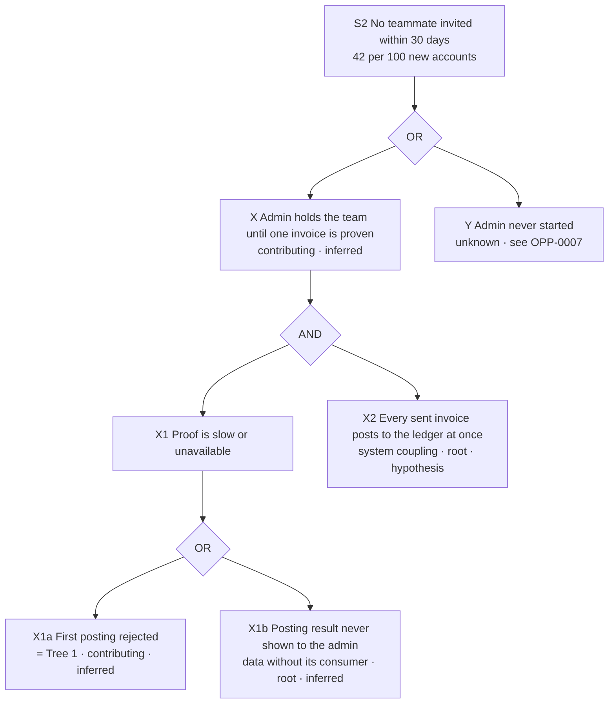

# Service blueprint: Agree how invoices land in the books

> **Fictional example.** Ledgerly, its systems, policies and figures are invented for illustration. Produced with `service-blueprinting` and its root-cause-analysis method.

- Journey ID: `JRN-CUST-SAAS-ONBOARD-001`
- Episode node ID: `NOD-CUST-SAAS-ONBOARD-001-02-02`
- Actor ID: `ACT-CUST-SMB-ADMIN-01`; also `ACT-PART-ACCOUNTANT-01`, `ACT-EMP-ONBOARD-SPEC-01`
- State: current
- Version: 1.1, 2026-09-22

Why this episode: the strongest frictions in the current-state map meet here, the moment `MTM-0002` sits here, and every source type in the study touches it.

## 1. Blueprint

One row per step of the admin's progress. Evidence status applies to the row's backstage and failure-mode claims. Rows that describe intended work, known from owners rather than records, are marked `hypothesis`.

| Node ID | Step | Actor action | Frontstage | Backstage | Supporting process/team | Policy/rule | Data | Systems | Automation/AI | Failure mode | Evidence status | Evidence IDs | Metric IDs | Owner |
|---|---|---|---|---|---|---|---|---|---|---|---|---|---|---|
| `NOD-CUST-SAAS-ONBOARD-001-02-02` | A. Open mapping | Reaches the mapping screen after connecting the ledger | Mapping screen listing ledger codes | Connector pulls chart of accounts and tax codes | Accounting Integrations squad | No link found at policy layer | Ledger codes copied on connect | Ledger connector | Auto-matcher runs (see §2) | — | observed | `EVD-2026-0003` | — | Product Manager, Accounting Integrations |
| `NOD-CUST-SAAS-ONBOARD-001-02-02` | B. Review suggested mapping | Scans pairs; most look plausible | Pairs pre-filled; unmatched rates shown with the default code, not flagged | — | — | No link found at policy layer | No record of which pairs were defaulted | Auto-matcher (rules) | Silent default for unmatched rates | FM1 silent default | observed | `EVD-2026-0003` | `MET-0003` | Product Manager, Accounting Integrations |
| `NOD-CUST-SAAS-ONBOARD-001-02-02` | C. Refer the question out | Screenshots the screen and emails the accountant | Nothing: the question leaves Ledgerly | None | No team handles an open mapping question (to be confirmed by RACI check) | Every login, including an adviser's, consumes a paid seat | No record that a question is open, with whom, or since when | Email outside Ledgerly | — | FM2 question leaves the service | hypothesis (ownership and "no record" claims); the referral itself is observed | `EVD-2026-0005`, `EVD-2026-0007`, `EVD-2026-0010` | `MET-0015` | none assigned |
| `NOD-CUST-SAAS-ONBOARD-001-02-02` | D. Apply an answer or a guess | Enters the accountant's answer, or guesses; 10+ seat accounts may book a session | Mapping screen; video session | Specialist maps on screen-share (median 22 of 45 min) | Onboarding Operations schedules sessions (median 6 business days) | Live sessions only for 10+ seats | Mapping saved without author or source | Mapping store; scheduling tool | — | FM3 guess under time pressure; FM4 session wait or refusal | observed (sessions, policy); guessing inferred | `EVD-2026-0009`, `EVD-2026-0010`, `EVD-2026-0011`, `EVD-2026-0017` | `MET-0004`, `MET-0008` | Onboarding Operations Lead |
| `NOD-CUST-SAAS-ONBOARD-001-02-02` | E. First sync posts | Sends a real invoice; sees "Synced" or "Sync failed" | Sync status badge | Connector posts to the ledger; ledger validates tax code | Ledger vendors (3) | Ledger rejects a tax code that does not match the rate (vendor rule: condition) | Posting result per invoice, kept in the connector log | Ledger API | No automatic retry | FM1 surfaces here, days after the decision | observed | `EVD-2026-0003` | `MET-0003`, `MET-0016`, `MET-0011` | Product Manager, Accounting Integrations |
| `NOD-CUST-SAAS-ONBOARD-001-02-02` | F. Rejection and recovery | Opens a ticket, retries, or stops | Generic "Sync failed, check your settings"; help desk reply | Agent reads the connector error and replies with a help article | Help desk tier 1; no escalation path to Integrations for mapping (owner statement) | Ticket closed when the admin says they will check with their accountant (practice reported by help desk lead, not reviewed in records) | Error code only; no link to the pair that caused it | Help desk tool; sync error log | — | FM5 error without cause; FM6 premature closure | hypothesis (closure practice, escalation path); reopen rate observed | `EVD-2026-0004` | `MET-0002` | Help desk lead; no owner for recovery end to end |

## 2. Automation: tax-rate auto-matcher

Rule-based, no machine learning. It is recorded as a service actor because it takes a decision the admin believes they made.

| Aspect | Current behaviour | Status |
|---|---|---|
| Trigger | Ledger connection completes | observed |
| Inputs | Ledger tax codes and account names; Ledgerly tax rates | observed |
| Decision | Pairs each rate with a ledger code by name and percentage; if nothing matches, assigns the ledger's default code | observed (`EVD-2026-0003`) |
| Confidence handling | None; exact and defaulted matches look identical | observed |
| Human review / override | Implicit: the admin is expected to scan the list | observed |
| Escalation | None | observed |
| Failure behaviour | The wrong pair is saved; the failure appears only when the ledger rejects a posting | observed (22 of 30 traced rejections) |
| Audit trail | The sync log records the rejection, not the pairing decision | observed |
| User communication | Generic failure banner after rejection | observed |

## 3. Failure modes

| ID | Failure | Where it originates | Admin impact | Evidence | Status |
|---|---|---|---|---|---|
| FM1 | Unmatched tax rate silently defaulted | Automation, data | Posting rejected days later; the admin cannot tell which choice was wrong | `EVD-2026-0003` | observed |
| FM2 | Mapping question leaves the service with no record, context or date | Policy (seat rule), ownership | Set-up pauses for an unmeasured period | `EVD-2026-0005`, `EVD-2026-0007` | observed that it leaves; "no owner" hypothesis |
| FM3 | Admin guesses to keep moving | Consequence of FM2 | Feeds rejections and the retry loop | `EVD-2026-0003` (8 of 30 admin-edited), `EVD-2026-0017` | inferred |
| FM4 | Session wait, or no session below 10 seats | Policy, capacity | Help after a median 6 business days, or not at all | `EVD-2026-0009`, `EVD-2026-0010` | observed |
| FM5 | Error message names no cause | Data | Admin retries blind | `EVD-2026-0003`, `EVD-2026-0004` | observed |
| FM6 | Ticket closed on "I'll check with my accountant" | Support practice | Admin re-contacts; 27% of mapping tickets reopen | `EVD-2026-0004` (reopen rate only) | hypothesis. Check: review the help desk closure macro and 30 closed mapping tickets; falsified if most were closed after a resolution |

## 4. Root-cause analysis

Two actor-visible symptoms, one tree each. Every edge carries its own status; a root cause is no stronger than the weakest link between it and its symptom. Layers checked on every branch: frontstage, backstage, support process, policy, data, system, ownership; "no link found" is stated where a layer was checked and came up empty.

### Tree 1: the first real invoice is rejected

**Symptom S1.** Admins at `NOD-CUST-SAAS-ONBOARD-001-02-02` see their first real invoice rejected when it posts to the ledger: 125 of 321 first sync attempts, about 30 per 100 new accounts, Jan–May 2026 signatures (`EVD-2026-0003`). Where it does not occur: 61% of first attempts, and, in interviews, all 5 admins with an in-house bookkeeper (`EVD-2026-0017`).

```mermaid
flowchart TD
    S1["S1 First real invoice rejected at posting<br/>125 of 321 first attempts"] --> G1{OR}
    G1 --> A["A Unmatched rate silently set to the default code<br/>automation · root · observed"]
    G1 --> B["B Admin entered a pair they could not confirm<br/>contributing · inferred"]
    B --> G2{AND}
    G2 --> C1["C1 Books kept by an outside accountant<br/>condition · inferred"]
    G2 --> B1["B1 Accountant cannot answer in time, with context<br/>partner · contributing · inferred"]
    B1 --> G6{OR}
    G6 --> P1["P1 Adviser login costs a paid seat<br/>policy · root · inferred"]
    G6 --> B2["B2 No record or owner for an open mapping question<br/>ownership · root · hypothesis"]
    B1 --> B3["B3 Live help declined below 10 seats or slow<br/>policy and queue · contributing · inferred"]
    S1 --> CV["Ledger rejects mismatched tax codes<br/>vendor rule · condition · observed"]
```

Gate checks. **OR at S1:** each input alone produces a rejection. The trace shows 22 rejections with only the default code and 8 with only an admin-edited pair. **AND at B:** both inputs can hold together, and removing either prevents the guess. Admins who keep their own books map in one sitting (C1 absent), and an admin whose accountant can answer has no need to guess (B1 absent). **OR at B1:** either root alone leaves the accountant unable to answer in time. Without access (P1), the accountant answers from a screenshot. Without a record or owner (B2), nobody sees or chases the wait. **B3 is contributing, not an AND input:** in 7 of 11 sessions the admin still phoned the accountant, so a session does not replace the accountant's knowledge.

| effect | cause | layer | cause type | evidence_ids | evidence_status | test applied | owner |
|---|---|---|---|---|---|---|---|
| S1 first posting rejected | A: unmatched rate silently assigned the ledger's default code | system / automation | root | `EVD-2026-0003` | observed | Mechanism trace: 22 of 30 rejected first postings carried the defaulted code | Product Manager, Accounting Integrations |
| S1 first posting rejected | B: admin entered a pair they could not confirm | frontstage / data | contributing | `EVD-2026-0003`, `EVD-2026-0005` | inferred | Mechanism trace shows 8 of 30 admin-edited pairs; that they were guesses rests on interviews | — (explained by B1, B2) |
| B | C1: books kept by an outside accountant, so the admin lacks the knowledge | environment | condition | `EVD-2026-0017` | inferred | Unstratified comparison: 5 in-house vs 9 external-accountant interviewees; the in-house five are also the five successful accounts, so selection on outcome confounds it | — (design around it) |
| B | B1: accountant cannot answer in time, with context | partner | contributing | `EVD-2026-0005`, `EVD-2026-0007` | inferred | Interviews on both sides (admins waited; accountants lacked context); no timing record | — (explained by P1, B2) |
| B1 | P1: an adviser login costs a paid seat, so the accountant has no access | policy | root | `EVD-2026-0007`, `EVD-2026-0010` | inferred | Policy text observed; that it keeps accountants out rests on 3 of 4 accountants' statements. Check once `INI-0004` adds the field: adviser logins in external-accountant accounts | Pricing and Packaging Lead (policy); Product Manager, Accounting Integrations (access path) |
| B1 | B2: no record of an open mapping question and no role accountable for it | ownership / data | root | `EVD-2026-0005` | hypothesis | None yet. Check: RACI review with Integrations, Onboarding Operations and help desk at the 2026-10-14 review; falsified if any role already tracks open questions | none assigned (finding) |
| B1 | B3: live help declined below 10 seats, median 6 business days above | policy / support process | contributing | `EVD-2026-0009`, `EVD-2026-0010`, `EVD-2026-0011` | inferred | Records observed; link to B1 reasoned, and 7 of 11 sessions still needed the accountant | Onboarding Operations Lead |
| S1 | Ledger vendor rejects a tax code that does not match the rate | partner | condition | `EVD-2026-0003` | observed | — | — |

Layers checked with no link found: backstage work inside the connector (postings go straight to the ledger, `EVD-2026-0003`). Not checked: team incentives at the help desk; listed under families below.

### Tree 2: the admin does not bring the team in

**Symptom S2.** Admins do not invite their team: 42 per 100 new accounts send no invite within 30 days of signature, Jan–May 2026 (`EVD-2026-0008`). Where it occurs less: among accounts that attempted a sync, those with a first synced invoice within the pre-specified 7 days sent an invite within 30 days at 81% (65/80), vs 58% (139/241) for later ones and 38% (35/91) for accounts that never connected a ledger (`EVD-2026-0021`).

Gate checks. **AND at X:** an admin holds the team back only while proof is missing *and* a teammate's invoice would post straight into the books. If postings were held until confirmation, missing proof would not need to stop the team. This is a hypothesis, and `INI-0003` is the test that could falsify it. **OR at X1:** a rejected first posting delays proof on its own, and so does an accepted one that the admin cannot see.

| effect | cause | layer | cause type | evidence_ids | evidence_status | test applied | owner |
|---|---|---|---|---|---|---|---|
| S2 no invite in 30 days | X: admin holds the team until one invoice is proven correct | frontstage (actor decision) | contributing | `EVD-2026-0006`, `EVD-2026-0021` | inferred | Stated intent (8 of 14) plus a comparison of invite rates by first-sync timing (81% vs 58%), not stratified; no per-account link between verification and invites | — (explained by X1, X2) |
| X | X1a: first posting rejected (Tree 1) | system | contributing | `EVD-2026-0002` | inferred | Unstratified comparison: median 23 vs 9 days to first synced invoice by first-sync outcome | see Tree 1 |
| X | X1b: posting result kept in the connector log, never shown to the admin next to the invoice | data | root | `EVD-2026-0006`, `EVD-2026-0003` | inferred | Mechanism described in interviews (admins open the ledger by hand); the absence of a view is a product fact, not traced per account | Director of Customer Onboarding |
| X | X2: every sent invoice posts to the ledger immediately | system | root | `EVD-2026-0006` | hypothesis | None; the smallest experiment that could test it is `INI-0003` | Product Manager, Accounting Integrations |
| S2 | Y: admin never started | — | not typed: cause unknown | `EVD-2026-0001` | unknown | — | Research Operations Lead (`OPP-0007`) |

### Root-cause families checked

| Family | Found? |
|---|---|
| Ownership gap | Yes, B2 (hypothesis) |
| Policy written for the exception | Possibly: the seat rule was written for paying users, and advisers were not considered (P1). Not confirmed with the policy owner |
| Data created without its consumer | Yes, X1b; also the unrecorded pairing decision in FM1 |
| Status invisibility | Yes, FM2: the admin cannot see a question's age |
| Queue design | B3 wait is observed (median 6 business days); how the session queue is ordered was not checked |
| Incentive conflict | Not checked: help desk measures were not reviewed. Relevant to FM6 |
| Brittle automation | Yes, A |
| Handoff loss | Yes, screenshots by email lose the invoice context (`EVD-2026-0007`) |

### From root causes to opportunities

Path statuses are the weakest link from symptom to root: A is observed (one link); S1 → B → B1 → P1 is inferred; S1 → B → B1 → B2 is hypothesis. One opportunity per root cause: A → `OPP-0001`, P1 → `OPP-0008`, B2 → `OPP-0009`, X1b → `OPP-0002`, X2 → `OPP-0003`. The contributing cause B3 has its own actor-visible symptom (declined help requests) and its own opportunity, `OPP-0005`. The condition C1 is designed around, not fixed.

## 5. Critical dependencies

- Three ledger vendors' APIs, which report errors with different specificity (`EVD-2026-0003` limitation).
- The accountant's willingness to engage, which Ledgerly does not control and has not tested.
- Pricing and Packaging decision rights over adviser seats.

## 6. Ownership gaps

- No role is known to own the period when a mapping question is outside Ledgerly (B2, pending the RACI check).
- No one owns mapping recovery end to end. The help desk closes tickets and Integrations sees only error codes.

## 7. Service risks

- Flagging instead of defaulting (A) adds visible work at connection. That trade is worth it only if `MET-0002` improves, and it must not raise `MET-0016` (fast) or `MET-0011` (confirmatory). Rollout is limited to the two ledgers with a change feed (`EVD-2026-0022`).
- Scoped adviser access (P1) widens who can see a customer's books. It needs a permission scope, revocation and an audit trail.

## 8. Metrics at the layer where the cause lives

`MET-0003` (automation, A), `MET-0015` (ownership and data, B2), `MET-0004` and `MET-0008` (policy and queue, B3), `MET-0016` and `MET-0011` (fast and confirmatory guardrails on posting accuracy). Definitions and validity in [metric-register.csv](metric-register.csv).
