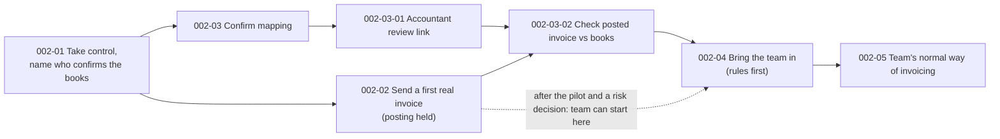

# Target-state journey: Get the team invoicing in the service

> **Fictional example.** Ledgerly and all evidence are invented for illustration. Produced with `target-experience-design`. Everything on this page is design intent (`hypothesis`) unless it cites observed evidence as its reason.

| Field | Value |
|---|---|
| Target journey | `JRN-CUST-SAAS-ONBOARD-002` (state target, draft, v0.5; `baseline_journey_id` = `JRN-CUST-SAAS-ONBOARD-001`) |
| Transitional journey | `JRN-CUST-SAAS-ONBOARD-003` (state transitional, Q1 2027) |
| Responds to | `OPP-0001`, `OPP-0008`, `OPP-0009`, `OPP-0002`, `OPP-0003` |
| End (actor outcome) | Same as current: the team invoices through Ledgerly as its normal way of working and the admin has stopped checking postings by hand |
| Horizon | Target by end of Q2 2027. Principle 4 depends on `INI-0003`, which can screen for gross harm but cannot show safety ([stats.md](stats.md) §8) |

## 1. Experience principles

Each principle is written so it can settle a design disagreement, and each lists a decision it has already settled.

1. **The admin always knows what is blocking the books, who holds the next action, and since when.** Settled: an open mapping question is shown in the product even though Ledgerly cannot answer it. (From `MTM-0002`, `EVD-2026-0005`.)
2. **Accounting decisions go to the person who can make them, with the context they need, without costing the customer a seat.** Settled: accountant review is a scoped link, not a full login. (From `EVD-2026-0007`, `EVD-2026-0010`.)
3. **Nothing is silently assumed about the customer's books.** Every automated pair shows whether it was matched or guessed. Settled: the auto-matcher flags rather than defaults, even though that adds work at connection. (From `EVD-2026-0003`.)
4. **Team use waits on accounting set-up only where accuracy is actually at risk.** Provisional until `INI-0003` reports and the journey owner decides whether to accept the risk that remains. It conflicts with principle 3 if invoices are sent before mapping is confirmed. The conflict is resolved by holding the posting rather than the sending, and by the stop rule on the fast guardrail `MET-0016`.

## 2. Target outcomes

| For | Outcome | Measured by |
|---|---|---|
| Admin | Team invoicing within 30 days without doubting the books | `MET-0001` toward 42% (read as a trend; see [stats.md](stats.md)); `MET-0006` baseline, then a rise |
| Team member | A first week with no permission surprises | `MET-0014` falls from its baseline |
| Accountant | Can answer a mapping question in one pass | `MET-0015` baseline, then a fall |
| Onboarding specialist | Session time spent on the customer's workflow, not on mapping | `MET-0008` falls (no target until its edge is checked) |
| Business | Retention not worse, cost-to-serve held | `MET-0009` monitored; `MET-0010` at or below 1.6 h |
| Guardrails | No rise in mis-posted invoices or unapproved sends | `MET-0016` (fast), `MET-0011` (60-day confirmatory), `MET-0012` |

## 3. Target journey

The main structural change from the current state: the first real invoice moves ahead of mapping confirmation, and confirmation becomes a joint step with the accountant.

| Stage / episode | Target behaviour | Service promise | Channel role | Moment | Recovery built in |
|---|---|---|---|---|---|
| `NOD-CUST-SAAS-ONBOARD-002-01` Take control and name who confirms the books | At first login the admin says whether an outside accountant keeps the books, and invites them to review | "We'll tell you what needs your accountant and send them what they need" | Product; email only for the accountant's link | — | Admin can skip; the question returns at stage 3 |
| `NOD-CUST-SAAS-ONBOARD-002-02` Send a first real invoice | Admin sends a real invoice on day 1–3; ledger posting is held until mapping is confirmed (only after `INI-0003` and a recorded risk decision) | "Your invoice goes out now; it reaches your books once your mapping is confirmed" | Product | `MTM-0001` moves here | Held postings listed for admin and accountant |
| `NOD-CUST-SAAS-ONBOARD-002-03` Confirm how invoices land in the books | Mapping confirmed by whoever has the knowledge | "Nothing posts on a guess" | Product and review link | `MTM-0002` | Accountant reminded at 2 business days; the admin sees the wait and can hand the question to a specialist |
| `NOD-CUST-SAAS-ONBOARD-002-03-01` Accountant reviews the proposed mapping | Accountant approves or corrects each flagged pair through a scoped link | Link shows only mapping and the invoice types in use; revocable | Review link (no seat) | `MTM-0002` | Accountant can reply "call me", which opens a specialist request (seat rule permitting; see `OPP-0005`) |
| `NOD-CUST-SAAS-ONBOARD-002-03-02` Check the first posted invoice against the books | Admin sees the posted invoice beside its ledger entry and marks it verified | "You can see it landed right" | Product | `MTM-0001` | A mismatch opens a pre-filled correction naming the pair that caused it |
| `NOD-CUST-SAAS-ONBOARD-002-04` Bring the team in | Rules set before invites; teammates arrive with stable permissions | "Your team's first week won't change under them" | Product, invite email | `MTM-0003` | A blocked teammate sees why and who can unblock them |
| `NOD-CUST-SAAS-ONBOARD-002-05` Make Ledgerly the team's normal way of invoicing | Team invoices through Ledgerly; the admin relies on verification instead of hand checks | — | Product | — | — |

## 4. Failure and recovery scenario

**The accountant does not reply.** A 6-seat account named an external accountant on day 1 and sent a real invoice on day 2, with posting held. By day 4 the review link has not been opened.

1. Day 3: the accountant gets one reminder listing the flagged pairs. The admin sees "Waiting on your accountant for 2 business days" (principle 1).
2. Day 5: the admin is offered two routes. They can confirm the flagged pairs themselves, with each pair's consequence explained, or hand the question to a specialist. Under today's tier policy the specialist route is closed to a 6-seat account, which is exactly what `OPP-0005` is about. Until that is decided, the admin has only the first route.
3. If the admin confirms a pair and the posting is later corrected in the ledger, the correction counts in `MET-0016` (within 14 days) and `MET-0011` (within 60), and the pair is flagged for the accountant's next visit.
4. Held postings stay listed and exportable, so the admin's books are never silently incomplete.

**High-risk edge case: an admin confirms a wrong mapping to unblock the team.** Postings go through and are wrong in the ledger. `MET-0016` exists to catch this quickly, and `MET-0011` confirms it at 60 days. Stop rule for `INI-0003`: at each weekly look, if the cluster-adjusted excess of 14-day corrections in the treatment group crosses the O'Brien–Fleming-type boundary (z from 5.86 at week 1 to 2.07 at week 8), sending-before-confirmation is switched off for new accounts within one business day. The pilot can only see a doubling of the correction rate. Smaller harm would pass unnoticed, which is why the rollout decision is recorded as a risk acceptance.

**Segment variation: in-house bookkeeper.** Answering "we keep our own books" at stage `NOD-CUST-SAAS-ONBOARD-002-01` skips the review link and the reminders. These admins already map in one sitting (`EVD-2026-0017`, inferred), and the target must not slow them down.

## 5. Service implications

| Area | Change |
|---|---|
| People / roles | A named owner for open mapping questions (after the RACI check, `OPP-0009`); specialists take hand-offs from any account size if `OPP-0005` is decided that way |
| Process | An open mapping question has an owner and a visible age; help desk closure practice reviewed (FM6) |
| Policy | Scoped adviser review does not consume a paid seat; tier policy reconsidered after `INI-0001` |
| Data | Each pair records who set it and whether it was matched or guessed; rejections link back to the pair |
| Systems | Held-posting queue in the connector; ledger-side change feed for `MET-0011` |
| Automation | Auto-matcher flags instead of defaulting; guessed pairs are never posted automatically |
| Partners | Accountants become named participants with a scoped view and an audit trail |
| Governance | Guardrail stop rule owned by Accounting Integrations; roll-out and any risk acceptance decided by the journey owner ([governance.md](governance.md)) |

## 6. Capability gaps

- **Held postings** do not exist in the connector. One of the three ledger vendors' APIs may not support deferred posting; this has not been checked. Without it, stage `NOD-CUST-SAAS-ONBOARD-002-02` cannot work for that vendor's customers.
- **Scoped external access** does not exist in the permission model and is the larger part of `INI-0001`.
- **A ledger change feed** exists for two of the three ledgers (`EVD-2026-0022`). `MET-0016` and `MET-0011` cover only those two, so every change ships only to them. The third ledger's customers stay on current behaviour until a feed or a validated proxy exists.

## 7. Assumptions and experiments

| Assumption | Why it matters | Current status | Test | Initiative |
|---|---|---|---|---|
| Flagging unmatched rates prevents most silent-default rejections | Value of `OPP-0001` | observed mechanism (22 of 30); effect of flagging untested | `MET-0003` on the rolling p-chart before and after launch. A before/after reading is `inferred` at most, and year-end tax-rate changes fall in the same window | `INI-0001` |
| Accountants answer through a link faster than by email | Value of `OPP-0008` | hypothesis (4 accountants) | Prototype link with 8 accountants before build; `MET-0015` after launch | `INI-0001` |
| Admins invite the team once they see the first invoice verified | Edge `MET-0006 → MET-0005`; causal part of `MTM-0001` | inferred from stated intent | Randomized by account, about 170 per arm, January to June 2027; MDE about 15 points on `MET-0005` | `INI-0002` |
| Sending before confirmation does not raise mis-posting | Safety of principle 4 | hypothesis; no baseline | Harm-screening pilot, about 49 accounts per arm, 8 weeks, weekly sequential looks on `MET-0016`. It detects a doubling only; non-inferiority at 5 per 1,000 needs about 790 per arm ([stats.md](stats.md)) | `INI-0003` after `INI-0004` |
| The external-accountant segment is large enough to matter | Priority of `OPP-0008`, `OPP-0009` | unknown (`EVD-2026-0018`) | Field populated at signature | `INI-0004` |
| The team-value threshold matches customers' own sense of "working" | Validity of `MET-0001` | inferred | Quarterly interviews ([metric-tree.md](metric-tree.md)) | research |

## 8. Transitional state: `JRN-CUST-SAAS-ONBOARD-003`

Q1 2027. Live: guardrail instrumentation (`INI-0004`). Then, once its baselines exist (2026-12-07): flagging of unmatched rates (`INI-0001`) on the two ledgers with a change feed, and first-invoice verification (`INI-0002`) for the randomized half of accounts. The accountant review link stays a prototype until the external-accountant segment is sized. Not live: sending before confirmation (`INI-0003`) and any tier policy change (`OPP-0005`).

What the admin experiences in the transitional state: the stages keep their current order (mapping, then first invoice, then team). On two ledgers, unmatched rates are flagged. Half of the accounts can verify their first posted invoice. Mapping questions still leave the product. Team start still follows accounting set-up, so `MTM-0001` still gates it. The transitional journey is registered separately so that its metrics are read against their own baseline and not credited to the target.

It is retired when `INI-0003` is decided. If the pilot shows no gross harm and the owner accepts the risk that remains, the target becomes current and `JRN-CUST-SAAS-ONBOARD-001` is archived. If it fails, the target is redesigned without principle 4.

## 9. Metric expectations

| Metric | Transitional (Q1 2027) | Target (end of Q2 2027) |
|---|---|---|
| `MET-0003` | toward 80% on two ledgers (p-chart; inferred) | ≥ 80% |
| `MET-0002` | median 12 → 9 days or fewer | lower still if the pilot passes |
| `MET-0005` | randomized difference, detectable at about 15 points | further rise if team start decouples |
| `MET-0001` | upward trend; one quarter cannot confirm a change under about 11 points | 42% or more over two quarters |
| `MET-0016`, `MET-0011`, `MET-0012` | backfilled baselines by 2026-12-07; no control-limit breach after launches | no boundary crossing; 60-day read within margin |
| `MET-0010` | ≤ 1.6 h | ≤ 1.6 h |
