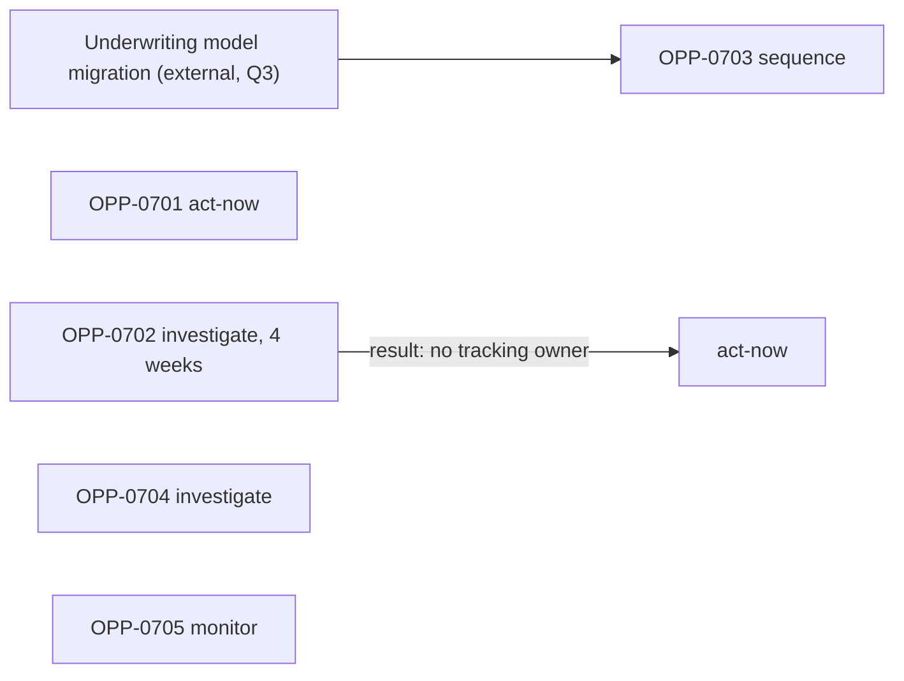

# Prioritization method

Method for turning problems, moments, and root causes into solution-independent opportunities and deciding what to do about each: act now, investigate, sequence, monitor, or deprioritize. Use it in workflow steps 1–7. The result fills `assets/opportunity-register.csv` and a short decision record per opportunity.

The method keeps four things apart that scoring models usually blend: how much is at stake, how sure we are, how urgent it is, and what it depends on. Decisions are made from the pattern across these, with explicit entry criteria, not from a single number.

Grounding: opportunity framing from Torres's opportunity solution tree; cost of delay from Reinertsen (2009); calibrated range estimates from Hubbard; levels of measurement from Stevens (1946), which explain why multiplying ordinal scores misleads; reversibility from Amazon's Type 1 / Type 2 decision distinction; RICE (McBride, Intercom) and WSJF (Scaled Agile) as scoring models with stated limits.

## Inputs and output

Inputs: evidence register findings; selected moments with their `moment_ids`; root-cause tables from blueprint analysis; metric trees with baselines; stakeholder requests (recorded as `stakeholder-input`).

Output per opportunity: one register row with `moment_ids`, `metric_ids`, `problem`, `root_cause`, `root_cause_status`, `evidence_ids`, `evidence_status`, `expected_value`, `feasibility`, `dependencies`, `risk`, `decision`, `owner`, `status`; and a decision record stating the entry criteria met, the ranges used, and what would change the decision.

## Step 1 — Inventory problems, not ideas

List every problem the inputs support, in the actor's terms, with its node:

`[Actor] at [node] [cannot / must / experiences] [problem], [size], evidence [IDs].`

- Convert every solution request into the problem it assumes. "Add a chatbot for status" becomes "applicants cannot find out where their application is"; the request's author is recorded, and the problem's `evidence_status` is `hypothesis` until evidence about actors supports it.
- Keep friction that does not touch a moment. It is still a problem; it will usually land in `monitor` or `deprioritize`, and that decision should be visible.

## Step 2 — Write the opportunity statement and test it

Template:

`Improve [actor outcome] at [node] by addressing [root cause or evidenced unmet need].`

Solution-independence tests; the statement passes only if all hold:

1. **Three solutions test.** You can name at least three materially different ways to address it (policy change, process change, information change, technology change).
2. **No mechanism named.** It contains no channel, technology, artifact, or team: no "app", "chatbot", "portal", "email", "form", "AI".
3. **Survives redesign.** It would still be true if the current channels or systems were replaced.
4. **Outcome is the actor's.** "Reduce calls" is the organization's outcome; "applicants know what happens next without calling" is the actor's. The organization's outcome goes into `metric_ids`, not the statement.
5. **Falsifiable.** You could tell, from a metric, whether it improved.

A statement that fails test 1 is usually a solution in disguise; move one level up by asking "what would this achieve for the actor?".

## Step 3 — One opportunity per root cause

- Where a root-cause analysis exists, write one opportunity per root cause, not per symptom. Two symptoms with one cause are one opportunity; one symptom with two independent causes (an OR branch) is two opportunities.
- Where the cause is not established, the opportunity still exists: set `root_cause` to the leading candidate or `unknown`, and `root_cause_status` to `hypothesis` or `unknown`. This routes it toward `investigate`; it does not remove it.
- Group opportunities that different channels or departments have written separately about the same root cause. Keep one row; list the others' sources in its evidence. This is where duplicated investment is prevented.
- Each opportunity belongs to one primary journey. If another journey is affected, link it through a relation such as `enables` or `depends_on`, not by listing both journeys.

## Step 4 — Link moments and metrics

- `moment_ids`: the moments this opportunity would improve. An opportunity serving a selected moment inherits that moment's disproportion evidence as part of its consequence case.
- `metric_ids`: the metric expected to move first (usually operational or behavioral) and the actor-outcome metric it should reach. If no metric exists, name the gap; an opportunity whose effect cannot be seen is not ready for `act-now`.

## Step 5 — Estimate reach and consequence as ranges

Point estimates hide uncertainty that should drive the decision. Give a low and a high value that you believe contains the true value with about 90% confidence (Hubbard's calibrated interval), and show the arithmetic.

- **Reach** = actors per period who pass the node × share affected. Use counts from records; if the share is from a sample, carry its interval.
- **Consequence per affected actor** = the change in the outcome when the problem is present, taken from the moment analysis or the metric tree (for example, a stratified gap in completion rate), or the cost to the actor (money, days, risk).
- **Realizable share** = how much of that consequence addressing the root cause could remove. This is usually the least known number; give it the widest range, and say where it came from (pilot, comparable change, judgment).
- **Expected value** = reach × consequence × realizable share, reported as a range in actor-outcome units ("200–700 more on-time completions per year"), and optionally in money.

Decision use: the lower bound tells you whether acting is safe to justify; the width tells you whether to investigate first. A range whose lower bound is near zero and upper bound is large is a signal for `investigate`, not for averaging to a middle value.

## Step 6 — Keep evidence strength as a separate axis

Record for each opportunity:

- `evidence_status` of the problem;
- `root_cause_status` of the cause;
- the quality of the estimate: measured, sampled, analog, or judgment.

Do not multiply "confidence" into value. RICE does this (reach × impact × confidence ÷ effort), which turns "important but unproven" into "unimportant". Weak evidence on a large consequence means the next step is learning, not deprioritizing.

## Step 7 — Cost of delay, reversibility, learning value

- **Cost of delay** (Reinertsen): what is lost per month the opportunity waits, in the same units as expected value. Check for time-critical shapes: a deadline (regulation, contract renewal), a window that closes (seasonal demand, rate changes), or harm that accumulates (actors affected each month who cannot be compensated later). A high cost of delay with weak evidence argues for a short, time-boxed investigation, not for waiting.
- **Reversibility**: are the likely responses two-way doors (cheap to undo: a message change, a routing rule) or one-way doors (policy commitments, system replacement, contract terms)? Reversible responses can be tried under weaker evidence; irreversible ones need `observed` problem and at least `inferred` cause. Also ask whether the actor's harm is reversible: irreversible harm raises urgency.
- **Learning value**: would a small test resolve the uncertainty that most affects the decision? If the decision would be the same whatever the test shows, the test has no decision value; skip it.

## Step 8 — Feasibility, risk, and dependency sequencing

- `feasibility`: whether the organization can address the root cause with the capabilities, authority, and time it has; name the constraint (policy owner, system, partner), not a number.
- `risk`: what could go wrong for actors or the organization if addressed badly; name the guardrail metric that would show it.
- `dependencies`: other opportunities (`OPP-` IDs), initiatives, or named external events the opportunity cannot proceed without.

Sequencing rules:

1. Draw the dependency graph. An opportunity whose dependency is not in place goes to `sequence`, with the dependency's owner and expected date.
2. An enabling opportunity (one that several others depend on) takes the priority of what it unlocks, even if its own actor-visible value is small.
3. Cycles mean two opportunities are really one, or a dependency is mis-stated; resolve before deciding.
4. Re-check `sequence` items when their dependency changes state, not only at the next review.

## Step 9 — Why weighted scores mislead, and when scoring is acceptable

Weighted scoring (rate each factor 1–5, multiply by weights, sum) looks objective and hides the judgment in three places:

- **Ordinal arithmetic.** A 1–5 rating is ordinal: "4" is more than "2" but not twice as much (Stevens 1946). Sums and products of ordinal ratings have no stable meaning; rescaling one factor can reorder the list.
- **Hidden weights.** Whoever sets the weights sets the ranking. Two defensible weight sets often produce different top items; the list shows only one.
- **Compensation.** A high score on reach can offset an `unknown` root cause, so an item that needs investigation appears ready to build.
- **False precision.** A score of 3.72 versus 3.65 invites decisions on noise.

Scoring is acceptable when all of these hold:

- the items are comparable (same team, similar size, same kind of change);
- the inputs are on ratio scales in real units (actors reached per quarter, days saved, cost), not 1–5 ratings;
- evidence strength is kept as a separate gate, not a multiplier;
- the score is used to order a list already filtered by the decision criteria below, not to make the decision;
- a sensitivity check shows the top items stay on top under reasonable weight changes.

RICE is usable in this narrow sense for a single team's backlog. WSJF (cost of delay ÷ job duration) is sound when cost of delay and duration are estimated in real units; SAFe's relative Fibonacci version is ordinal, so treat it as a structured conversation, not a measurement.

## Step 10 — Handle stakeholder power in the open

- Record who requested an item and when. Their input is `stakeholder-input` evidence and supports `hypothesis` at most.
- Requested items pass through the same tests and entry criteria as any other.
- If a leader decides to act against the criteria, record it as a decision override: who decided, the reason, and which criterion was not met. Do not change the evidence status to match the decision.
- Offer the requester the path to a different decision: the specific evidence that would move the item to `act-now`.

## Step 11 — Assign a decision bucket

| decision | Entry criteria (all must hold) | Must record |
|---|---|---|
| `act-now` | Problem `observed`; root cause `observed` or `inferred` with reasoning; lower bound of expected value material; no unmet dependency; owner accepts; outcome metric and guardrail named | Expected metric movement and date; guardrail threshold |
| `investigate` | Upper bound material, but problem or root cause is `hypothesis`/`unknown`, or the range is too wide to decide | Question, method, owner, time-box, and the result that would move it to `act-now` or `deprioritize` |
| `sequence` | Would meet `act-now` or `investigate` criteria, but a named dependency is not in place | Dependency, its owner and expected date, re-check trigger |
| `monitor` | Evidence adequate; value currently small or stable; could grow | Metric, threshold that reopens it, review date |
| `deprioritize` | Upper bound small, outside strategy, or dominated by another opportunity addressing the same root cause | Reason, and what would reopen it; the row is kept, not deleted |

An opportunity with high cost of delay and weak evidence goes to `investigate` with a short time-box; urgency changes the time-box, not the bucket.

## Step 12 — State expected movement and hand off

For `act-now` items, write the expected movement before any solution is chosen: "MET-0702 from 1.9 to ≤1.2 requests per application within two quarters; MET-0701 up 3–7 points for affected cohorts". Hand off to target-experience design or initiative planning with the opportunity ID; initiatives cite it in `opportunity_ids`.

## Failure modes

- Solutions entered as opportunities ("launch portal").
- One opportunity per symptom, producing several initiatives on one root cause.
- Point estimates presented without ranges; the middle of a wide range treated as a forecast.
- Confidence multiplied into value, so uncertain large problems vanish.
- `deprioritize` rows deleted, so the same idea returns without its history.
- Stakeholder requests silently promoted to `observed`.

## Worked example

Journey `JRN-CUST-MORTGAGE-001`, "Get a mortgage and complete a home purchase"; 18,000 applications per year; outcome `MET-0701` (on-time completion), baseline 71%. Moments from the moment analysis: `MTM-0701` (post-submission document requests), `MTM-0702` (below-price valuation), `MTM-0703` (offer expiry), `MTM-0704` (estimate versus decision).

Estimates:

| opportunity | reach per year | consequence per affected actor | realizable share | expected value per year |
|---|---|---|---|---|
| OPP-0701 | 4,000–4,700 applications with ≥2 requests | 22–25 pts lower on-time completion | 30–70% (judgment; no pilot) | ~260–820 more on-time completions |
| OPP-0702 | 450–600 expiring offers | higher rate for fixed term: 2,000–9,000 in extra interest per case | 50–90% | 225–540 actors spared; irreversible harm |
| OPP-0703 | 1,500–3,000 applicants whose decision is >10% below estimate | unknown effect on withdrawal | unknown | wide; lower bound near zero |
| OPP-0704 | ~1,100 below-price valuations | 43 pts lower on-time completion | unknown | wide |
| OPP-0705 | ~7,400 applicants with a failed upload | ≤2 pts, within strata | — | ≤150 on-time completions; likely near zero |

Register rows (abridged):

| opportunity_id | node_id | moment_ids | metric_ids | problem | root_cause | root_cause_status | evidence_status | dependencies | decision |
|---|---|---|---|---|---|---|---|---|---|
| OPP-0701 | NOD-CUST-MORTGAGE-001-02 | MTM-0701 | MET-0702;MET-0701 | Applicants are asked for further documents after submitting, and many withdraw | Documents required are decided by the underwriter after submission, not at application | observed | observed | — | act-now |
| OPP-0702 | NOD-CUST-MORTGAGE-001-04 | MTM-0703 | MET-0704;MET-0701 | Offers expire before completion and the rate cannot be restored | No one tracks offer expiry against the completion date across lender and conveyancer | hypothesis | observed | — | investigate |
| OPP-0703 | NOD-CUST-MORTGAGE-001-01 | MTM-0704 | MET-0705 | Applicants are approved for less than the estimate and lose confidence | Estimate uses a different affordability model from underwriting | observed | inferred | Underwriting model migration (Q3) | sequence |
| OPP-0704 | NOD-CUST-MORTGAGE-001-03-02 | MTM-0702 | MET-0703;MET-0701 | Applicants with a below-price valuation cannot decide what to do next | unknown | unknown | observed | — | investigate |
| OPP-0705 | NOD-CUST-MORTGAGE-001-02-01 | — | MET-0706 | Uploads fail and must be retried | File size limit below phone photo size | observed | observed | — | monitor |

Reading the decisions:

- OPP-0701 meets every `act-now` criterion; the lower bound (~260) is material and the likely responses (stating requirements at application, a checklist by income type) are reversible. Guardrail: underwriting quality, measured by early arrears.
- OPP-0702 has an observed problem, irreversible harm, and a cost of delay of roughly 40–50 expiries per month, but the ownership cause is a hypothesis. Decision: `investigate` with a four-week time-box (case trace of 30 expired offers); moves to `act-now` if more than half show no tracking by either party.
- OPP-0703's cause is observed, but the estimate cannot be aligned until the underwriting model migration ships. `sequence`, re-checked when the migration date moves.
- OPP-0704: consequence is large, root cause unknown. `investigate` with interviews of applicants after a below-price valuation.
- OPP-0705 is real friction with no outcome effect beyond ≤2 points. `monitor`, reopened if the failure rate rises above 50% or the stratified gap exceeds 3 points.
- A regional director requested "a mortgage status chatbot". Converted to the problem "applicants cannot see where their application is", recorded as `stakeholder-input`, status `hypothesis`, and merged into the investigation for stage 03; the request and its author are recorded.

Weighted-score check: with weights favoring reach, OPP-0705 (widest reach) outranks OPP-0702; with weights favoring severity, the order reverses. The decision buckets above do not change under either weight set, which is why the buckets, not the score, carry the decision.

## Quality checks

- Every opportunity passes the five solution-independence tests.
- One row per root cause; duplicates merged with sources kept.
- `moment_ids` and `metric_ids` filled or the gap named.
- Reach, consequence, and value given as ranges with the arithmetic shown.
- Evidence strength shown separately from value; no confidence multiplier.
- Each decision meets the bucket's entry criteria and records what would change it.
- Stakeholder requests and any overrides are visible.

## Sources

- Teresa Torres, Product Talk, opportunity solution trees: https://www.producttalk.org/opportunity-solution-trees/
- Donald G. Reinertsen, *The Principles of Product Development Flow: Second Generation Lean Product Development* (2009), Celeritas Publishing, ISBN 978-1-935401-00-1: https://openlibrary.org/books/OL26120187M/The_Principles_of_Product_Development_Flow
- Douglas W. Hubbard, *How to Measure Anything: Finding the Value of Intangibles in Business, 3rd Edition* (2014), Wiley: https://www.wiley.com/en-us/How+to+Measure+Anything:+Finding+the+Value+of+Intangibles+in+Business,+3rd+Edition-p-9781118539279
- S. S. Stevens, "On the Theory of Scales of Measurement", *Science* 103(2684), 677–680 (1946): https://doi.org/10.1126/science.103.2684.677
- Jeffrey P. Bezos, Amazon.com 2015 Letter to Shareholders (Type 1 and Type 2 decisions): https://www.sec.gov/Archives/edgar/data/1018724/000119312516530910/d168744dex991.htm
- Sean McBride, Intercom, "RICE: Simple prioritization for product managers": https://www.intercom.com/blog/rice-simple-prioritization-for-product-managers/
- Scaled Agile Framework, Weighted Shortest Job First (WSJF): https://framework.scaledagile.com/wsjf
