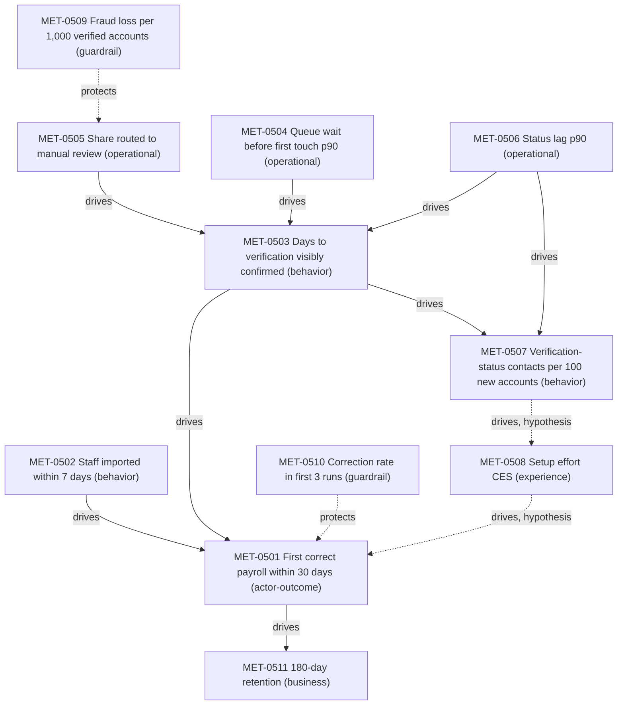

# Metric tree method

Method for building a causal measurement model for a journey: actor outcome → leading behavior → operational drivers, with guardrails on every lever. Use it in workflow steps 2–7. The result fills `assets/metric-tree-template.md`, the metric register, and the metric-edge register.

Grounding: standard measurement practice (explicit numerator, denominator, population, window), the goals–signals–metrics process behind Google's HEART framework (Rodden, Hutchinson & Fu 2010), and guardrail metrics from controlled experimentation (Kohavi, Tang & Xu 2020).

## Two kinds of claim, two places

The journey-architecture skill's ontology separates what a metric is from what it causes:

| Claim | Where it lives | Its `evidence_status` answers |
|---|---|---|
| "This metric measures what its name says, for its population" | Metric register row | Is the measure valid? |
| "Moving metric X moves metric Y" (`drives`) or "X must not degrade while Y is optimized" (`protects`) | Metric-edge register row | Is the causal or protective relation established? |

A metric can be perfectly valid and have no established effect on anything; an edge can be well evidenced between two imperfect measures. Keep the two statuses apart. A missing baseline affects neither: write "not yet measured" in `baseline`.

## Step 1 — Anchor on the actor outcome

Take the journey's `desired_outcome` from the journey registry and write one `actor-outcome` metric, attached to the journey itself. It is the root of the tree.

- It measures the actor's result, not the organization's activity: "first correct payroll within 30 days", not "onboarding calls completed".
- It is usually lagging: it resolves after the journey ends.
- If nothing currently measures the outcome, define it anyway, set `baseline` to "not yet measured", list the instrumentation needed, and set validity status from the evidence you have about the definition (often `hypothesis` until checked against records). Do not substitute an available proxy silently; name a proxy as a proxy.

## Step 2 — Build the tree downward

For each metric in the tree, ask in order:

1. **Leading behavior.** What actor behavior, observable earlier, precedes it? (Staff imported within 7 days.)
2. **Operational driver.** What service condition makes that behavior easier or harder? (Queue wait, status lag, share routed to manual review.)
3. **Experience signal.** What does the actor perceive about this part? (Setup effort.)
4. **Guardrail.** What could get worse if this lever is pushed? (Fraud loss if review is relaxed.)

Rules:

- Every metric except `business` and `guardrail` reaches the root through `drives` edges. `business` metrics are driven by the root; `guardrail` metrics `protect` the metric being optimized.
- Edge status: `observed` needs an experiment, a stratified counterfactual comparison (comparable groups, same period, stratified on known confounders, pre-period parity checked), or a mechanism traced in records. Correlation across cohorts, dose/variation, and timing support `inferred` at most. Untested edges are `hypothesis`. These are the same tests as the service-blueprinting root-cause method.
- Attach each metric to the lowest journey node where it is meaningful, by node ID. Operational drivers attach to the node whose experience they drive and name the blueprint layer where they live.
- Stop at 8–15 metrics for one L2 journey. Beyond that, the tree is a dashboard inventory.
- Available data does not decide the tree. Missing metrics are listed as instrumentation gaps.

## Step 3 — Define every metric with a card

A metric without a card is not in the model.

| Field | Content | Failure mode it prevents |
|---|---|---|
| `metric_id` | Metric ID per the ontology, for example `MET-0501` | Two teams computing "activation" differently |
| name | Plain words | Names that differ by team |
| layer | `actor-outcome`, `experience`, `behavior`, `operational`, `employee-service`, `business`, or `guardrail` | Mixing outcome and diagnostic metrics |
| formula | Numerator ÷ denominator, each a countable set | Ambiguous "rate" |
| unit | %, days, hours, count per 100, score | Comparing medians to means |
| population | Who is in the denominator; inclusions and exclusions | Denominator drift |
| time window | Cohort window or snapshot period; lag before it can be read | Reading a 30-day outcome after 10 days |
| source | System, event, query, or survey, and the evidence item behind the baseline | Unreproducible numbers |
| owner | Role accountable for the definition and for acting on it | Orphan metrics |
| direction | `increase`, `decrease`, `maintain` | Optimizing the wrong way |
| baseline | Value, period, and n; or "not yet measured" | Invented starting points |
| target | Value, date, population; or "set after baseline" | Targets without units |
| validity | `evidence_ids` and `evidence_status` for "measures what it claims" | Trusting a mislabeled event or tag |
| known biases | Sampling, survivorship, response bias, tagging error, definition changes | Overconfident reading |

## Step 4 — Leading vs lagging

- **Lagging** metrics confirm the outcome (retention, first correct payroll). You are accountable for them; they are too slow to steer with.
- **Leading** metrics move earlier and predict the lagging metric. Predictive correlation earns the `drives` edge `inferred`; an experiment or stratified counterfactual earns `observed`. Until one of these exists the edge is `hypothesis`, and the leading metric gets no target.
- Leading metrics are easier to game. Each one used as a target needs a guardrail and a periodic check that it still predicts the outcome.

## Step 5 — Cohort vs snapshot

| Type | Definition | Use for | Pitfall |
|---|---|---|---|
| Cohort | A fixed group that entered in a window (accounts signed in March), followed to an outcome or cut-off | Journey outcomes, stage conversion, time-to-X | The window must close; report open cohorts as provisional |
| Snapshot | Everything in flight at a point in time (queue wait today) | Operational load, service health | Mix changes move the number without any process change |

Outcome and stage-conversion metrics are cohort metrics by default; operational drivers are usually snapshots. Never divide a cohort numerator by a snapshot denominator.

## Step 6 — Baselines and targets

- **No baseline, no target.** For a metric never measured, the first target is "baseline measured by [date] with n ≥ [size]". `baseline` says "not yet measured"; validity status is unaffected.
- Measure at least one full cycle of natural variation (two or more cohorts, or enough weeks to cover the domain's seasonality) before setting a target.
- Express the target as a change against the baseline with date and population: "from 52% (Q2 cohorts, n=1,840) to 65% for next year's Q1 cohorts".
- External benchmarks are context, not targets, unless definition, population, and window match.
- **One target rule.** A metric may have a target only when it has a path to the root on which every `drives` edge is `inferred` or `observed`. If every path contains a `hypothesis` edge, the metric is tracked as a diagnostic with no target until that edge is tested. The target names the outcome it is expected to move and the weakest edge status on the path.
- Guardrail thresholds are limits, not targets; they sit on `protects` edges and are not subject to the path rule.

## Step 7 — Ratio pitfalls

- **Simpson's paradox.** An aggregate rate can move opposite to every segment's rate when the mix changes. Report the outcome by the segments that change the path (self-serve vs accountant-led) beside the total.
- **Survivorship.** Metrics computed on those who reached a stage ignore those who left before it. State the population and report drop-off beside it.
- **Moving denominators.** "% of tickets about X" moves when other tickets change. Use a denominator tied to the population at risk: contacts per 100 new accounts.
- **Rate vs volume.** A falling rate with rising volume can mean more actors harmed. Report both.
- **Skewed durations.** Use median and p90 for waits and cycle times; means hide the tail where complaints come from.
- **Definition changes.** When formula or instrumentation changes, restart or backfill the series; never splice silently.

## Step 8 — Experience measures: what each can tell

| Measure | Asks | Can tell | Cannot tell |
|---|---|---|---|
| CES (effort) | How easy was it to do X? | Perceived effort for a specific task or episode; suits stage level; Dixon, Freeman & Toman (2010) linked service effort to disloyalty | Why effort was high; whether the outcome was reached |
| CSAT | How satisfied are you with X? | Reaction to a specific interaction; sensitive to recent events | Relationship loyalty; comparison across very different touchpoints |
| NPS | How likely to recommend? | Relationship-level sentiment across the lifecycle; proposed by Reichheld (2003) as a growth predictor | Which stage caused the sentiment; change in a single stage |

NPS is not a stage metric. It asks about the relationship, so a stage-level NPS mixes the stage with everything before it, moves slowly, and is dominated by factors outside the stage. Use CES or a task-specific question at stage level; use NPS, if at all, at lifecycle (L1) level with a "why" follow-up.

For every survey measure: record response rate and sampling frame; trigger it at the node it measures; do not compare differently worded questions or scales; treat low-n results as qualitative signals.

## Step 9 — Guardrails for every optimization

For each metric you intend to push, name what could break:

- the same actor, harmed by the same lever;
- other actors (agents' workload, managers' approvals);
- quality and correctness (errors, rework);
- fairness and accessibility (outcome gaps by segment);
- the outcome itself (a leading metric that stops predicting).

A guardrail has a card, a threshold ("must not exceed 0.5 per 1,000"), a `protects` edge to the metric being optimized, and an owner who can stop the change. A change whose guardrail is unmeasured is not ready to ship.

## Step 10 — Reading change and noise

Every rate moves from period to period by chance. Decide in advance what counts as a real change.

- **Control limits.** For a proportion, plot each period on a p-chart: centre line p̄ (the baseline rate), limits p̄ ± 3·√(p̄(1−p̄)/n) for that period's n. A single point outside the limits, or a run of 8 consecutive points on one side of the centre line, signals change; movement inside the limits is noise. For medians and durations, use the run rule on the chart of the statistic and report the n behind each point.
- **Minimum n per reading period.** To see a shift of d (as a proportion) in a single point, n ≥ 9·p̄(1−p̄)/d². Example: MET-0501 at p̄ = 0.52 and d = 0.05 needs about 900 accounts per period. A monthly cohort of about 610 gives limits of ±6 points, so monthly points detect only large shifts; smaller ones need the run rule or a quarterly reading.
- **Cadence follows sample size.** Do not report weekly if weekly n gives limits wider than the change you care about. Read at the shortest period whose n meets the minimum; review more often only for operational snapshots with large n.
- **Survey measures.** Report n and response rate per period; suppress points below the minimum n rather than showing volatile values.
- **Before/after is not causal.** A shift after a change, even outside control limits, shows that something changed; it earns `inferred` for "the change caused it", because season, mix, and other changes coincide. `Observed` needs a concurrent comparison: an experiment, or a stratified counterfactual as in step 2. If the target-experience-design skill is installed, use its experiment-design method to set up that comparison.

## Step 11 — Journey health without one opaque score

Do not average stage metrics into a single index. Averages hide which stage broke, mix units, and reward trading one stage against another. Report a panel per journey:

1. the outcome metric (cohort, with trend);
2. the one or two leading metrics with the strongest edges;
3. each stage's key metric against threshold: `on track`, `watch`, or `off track`;
4. guardrails against their thresholds;
5. evidence freshness of the underlying data.

Portfolio views count journeys by status; they do not average scores.

## Worked example

Fictional scenario shared with the journey-research and service-blueprinting methods. Journey `JRN-CUST-PAYROLL-START-001`, "Start paying staff with the new payroll service", under lifecycle `LFC-CUST-PAYROLL-CLIENT-001`. Stages: 01 Find out what to do first; 02 Get company and staff data in; 03 Wait to be cleared to pay; 04 Prove payroll is right.

Metric register (abridged):

| metric_id | journey_or_node_id | layer | formula | unit / window | direction | baseline | target | evidence_ids | evidence_status (validity) |
|---|---|---|---|---|---|---|---|---|---|
| MET-0501 | JRN-CUST-PAYROLL-START-001 | actor-outcome | cohort accounts with a completed payroll run and no correction run within 30 days of contract ÷ all accounts in the monthly contract cohort | %, cohort, readable at day 31 | increase | 52% (Q2 cohorts, n=1,840) | 65% for next year's Q1 cohorts | EVD-2025-0521 | observed |
| MET-0502 | NOD-CUST-PAYROLL-START-001-02 | behavior | cohort accounts with ≥1 employee imported within 7 days of contract ÷ cohort accounts | %, cohort, day 8 | increase | 41% | 55% for next year's Q1 cohorts | EVD-2025-0522 | observed |
| MET-0503 | NOD-CUST-PAYROLL-START-001-03 | behavior | days from bank details submitted to verification shown as confirmed in the app, per account | days, median and p90, cohort | decrease | median 4.0, p90 9.0 | median ≤2, p90 ≤5 | EVD-2025-0511;EVD-2025-0513 | observed |
| MET-0504 | NOD-CUST-PAYROLL-START-001-03 | operational | hours from submission to first reviewer touch, p90 of items in queue at weekly snapshot | hours, weekly snapshot | decrease | 71 h | ≤24 h | EVD-2025-0513 | observed |
| MET-0505 | NOD-CUST-PAYROLL-START-001-03 | operational | verifications routed to manual review ÷ verifications submitted | %, monthly | decrease | 100% | set after risk scoping | EVD-2025-0513 | observed |
| MET-0506 | NOD-CUST-PAYROLL-START-001-03 | operational | hours from decision in risk tool to status visible in app, per verification | hours, p90, weekly | decrease | 22 h | ≤1 h | EVD-2025-0511 | observed |
| MET-0507 | NOD-CUST-PAYROLL-START-001-03 | behavior | contacts tagged verification-status in first 30 days ÷ new accounts in cohort × 100 | per 100 accounts, cohort | decrease | 31 | none: diagnostic until MET-0507 → MET-0508 is tested | EVD-2025-0505;EVD-2025-0523 | observed (tags 88% accurate in spot check) |
| MET-0508 | NOD-CUST-PAYROLL-START-001-02 | experience | respondents answering 5–7 on 7-point "It was easy to get set up to pay staff" ÷ respondents, surveyed when verification is confirmed | %, monthly; report response rate | increase | not yet measured | none; measure baseline by next quarter, n ≥ 200 | — | hypothesis (question not yet validated) |
| MET-0509 | NOD-CUST-PAYROLL-START-001-03 | guardrail | confirmed fraudulent accounts within 90 days of verification ÷ verified accounts × 1,000 | per 1,000, cohort, day 91 | maintain | 0.3 | ≤0.5 | EVD-2025-0524 | observed |
| MET-0510 | NOD-CUST-PAYROLL-START-001-04 | guardrail | correction runs among each account's first 3 runs ÷ first-3 runs | %, cohort | maintain | 3.1% | ≤3.5% | EVD-2025-0521 | observed |
| MET-0511 | LFC-CUST-PAYROLL-CLIENT-001 | business | cohort accounts active at day 180 ÷ cohort accounts | %, cohort | increase | 84% | context only | EVD-2025-0525 | observed |

Metric-edge register:

| from_metric_id | relation | to_metric_id | evidence_ids | evidence_status | note |
|---|---|---|---|---|---|
| MET-0502 | drives | MET-0501 | EVD-2025-0526 | inferred | Six cohorts: 71% vs 38% outcome for early vs late importers, within each setup variant; correlation only |
| MET-0503 | drives | MET-0501 | EVD-2025-0527 | inferred | Outcome falls with verification duration band in both variants; correlation only |
| MET-0505 | drives | MET-0503 | EVD-2025-0516 | observed | Stratified regional comparison with pre-period parity; low-risk band only |
| MET-0504 | drives | MET-0503 | EVD-2025-0513 | observed | Mechanism trace: 85% of elapsed time is queue wait before first touch |
| MET-0506 | drives | MET-0503 | EVD-2025-0511 | observed | Status lag is a traced component of time to visible confirmation (20 cases) |
| MET-0506 | drives | MET-0507 | EVD-2025-0511 | inferred | Lag observed; share of contacts made during the lag window not yet measured |
| MET-0503 | drives | MET-0507 | EVD-2025-0517 | inferred | Dose/variation: 9 to 41 contacts per 100 across duration bands |
| MET-0507 | drives | MET-0508 | — | hypothesis | Test once MET-0508 has a baseline |
| MET-0508 | drives | MET-0501 | — | hypothesis | Test once MET-0508 has a baseline |
| MET-0501 | drives | MET-0511 | EVD-2025-0525 | inferred | 91% vs 70% day-180 retention by outcome reached; correlation only |
| MET-0509 | protects | MET-0505 | — | hypothesis | Relaxing manual review may admit more fraud; threshold owned by risk policy owner |
| MET-0510 | protects | MET-0501 | — | hypothesis | Pushing faster first runs may raise corrections |

Evidence items introduced in this example (the others come from the research synthesis and root-cause analysis): EVD-2025-0521, audit of 50 accounts, outcome and correction definitions matched payroll records in 49; EVD-2025-0522, import event checked against 30 accounts' data; EVD-2025-0523, spot check of 100 tagged contacts, 88 correctly tagged; EVD-2025-0524, fraud case definition reviewed against risk records; EVD-2025-0525, billing records, day-180 retention by outcome reached; EVD-2025-0526 and EVD-2025-0527, cohort analyses stratified by setup variant.

Causal narrative: admins reach the outcome (MET-0501) when they get staff data in early (MET-0502) and are cleared to pay quickly (MET-0503); both links are correlational so far. Verification duration is driven by blanket manual review (MET-0505, established for the low-risk band) and queue wait (MET-0504, traced). Status contacts (MET-0507) follow duration and status lag. Scoping manual review is the largest established lever and is guarded by fraud loss (MET-0509). The first-run correction guardrail (MET-0510) prevents pushing admins to run payroll before their data is right.

Notes on the example:

- MET-0501 keeps accounts that cancel during setup in the denominator, so early churn cannot improve the rate.
- MET-0507 uses new accounts as denominator, not total tickets, so it does not fall merely because other ticket types rise.
- MET-0501 is reported by setup variant (self-serve vs accountant-led) to catch mix shifts.
- MET-0502 and MET-0503 both reach the root through `inferred` edges, so both may carry targets; the targets are expectations, and an experiment (for example, a guided import prompt for alternating cohorts) would raise the MET-0502 edge to `observed`.
- MET-0507 has no target: its only path to the root runs through MET-0508, and both edges on that path are `hypothesis`. It stays a diagnostic, and the root-cause analysis uses it to size the symptom.
- MET-0504, MET-0505, and MET-0506 reach the root through MET-0503 (`observed` then `inferred`), so they may carry targets.
- MET-0508 has no baseline; that is recorded in `baseline`. Its validity is `hypothesis` for a different reason: the question has not been checked against behavior.
- NPS is not in the tree; if used, it belongs to the lifecycle `LFC-CUST-PAYROLL-CLIENT-001`.

## Quality checks

- One actor-outcome metric attached to the journey; every other metric reaches it via `drives`, except business (driven by the root) and guardrails (`protects`).
- Every metric has a complete card; every ratio names numerator, denominator, population, and window.
- Metric-row status is about validity; edge status is about causation; neither is used for the other or for a missing baseline.
- No edge is `observed` on correlation, dose, or timing alone.
- No target without a measured baseline; no target on a metric whose every path to the root contains a `hypothesis` edge.
- Change is read against control limits with a stated minimum n; before/after readings claim `inferred` at most.
- Cohort and snapshot metrics are not mixed in one ratio.
- Each optimized metric has a guardrail with threshold and owner.
- Journey health is a panel, not a composite score.

## Sources

- Kerry Rodden, Hilary Hutchinson, Xin Fu, "Measuring the User Experience on a Large Scale: User-Centered Metrics for Web Applications", CHI 2010.
- Ron Kohavi, Diane Tang, Ya Xu, *Trustworthy Online Controlled Experiments*, Cambridge University Press, 2020.
- Matthew Dixon, Karen Freeman, Nicholas Toman, "Stop Trying to Delight Your Customers", *Harvard Business Review*, 2010.
- Frederick F. Reichheld, "The One Number You Need to Grow", *Harvard Business Review*, 2003.
- Stanford Encyclopedia of Philosophy, "Simpson's Paradox".
- NIST/SEMATECH *e-Handbook of Statistical Methods*, section 6.3.3.2, proportions control charts (p-chart).
