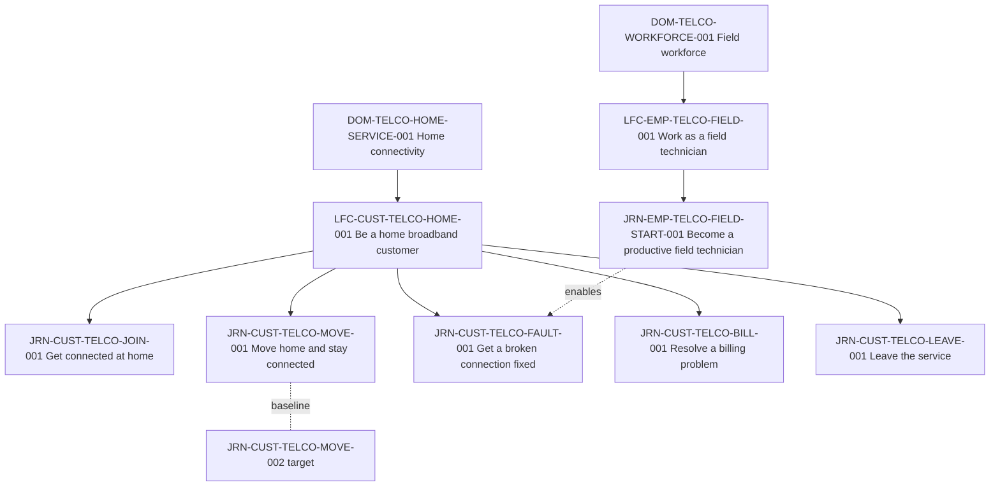

# Portfolio health

Method for turning a collection of journey artifacts into a governed portfolio: normalize the inventory, resolve duplicates, build coverage views, measure health with defined indicators, decide where management attention goes, and set review cadence and decision rights. Use it in workflow steps 1–8. The result fills `assets/portfolio-register.csv` and a health panel.

Health here means the portfolio can be trusted and acted on: each journey has an owner, current evidence, metrics, and links to the work addressing it. It is reported as a panel of named indicators, never as one opaque score.

Grounding: the shift from touchpoints to end-to-end journeys as the unit of management (Rawson, Duncan & Jones 2013); journey management practice with single-person ownership and scheduled review (Stickdorn, Smaply); decision-role clarity (Rogers & Blenko 2006); the journey hierarchy and register rules of the Journey Architecture OS ontology, which the `journey-architecture` skill defines.

## Step 1 — Collect and normalize the inventory

Collect every artifact that claims to describe a journey: maps, blueprints, slide decks, research reports, process maps named "journey", backlog epics named after journeys. Record for each: title, author team, date, actor, trigger, end point, channel scope, current or future, and the evidence it cites.

Normalize each into a candidate register row:

| Field | Rule |
|---|---|
| `name` | Verb + actor outcome ("Get a broken connection fixed"), not a team, system, or channel ("Fault management CJM") |
| `level` | `L0` domain, `L1` lifecycle, `L2` journey; anything smaller is a node inside a journey, not a portfolio row |
| `actor_id` | One actor per `LFC` and `JRN` row; a map covering two actors is two journeys or one journey with an `enables` relation to an employee journey |
| `state` | `current`, `target`, or `transitional`; a future-state map is a separate `target` journey that names its current journey as baseline |
| `status` | `draft` until validated with evidence; `stale` when the evidence no longer describes reality |
| `owner` | A named role that accepts accountability; empty if no one has accepted, never the author by default |
| `evidence_freshness` | From the governance rule for the journey; `unknown` when no rule or no evidence exists |
| `metric_coverage` | Computed from the node and metric registers (Step 4), not estimated |

Rules:

- Assign an ID once, when the row is created; never derive it from the artifact's title again.
- Keep a mapping from each source artifact to the row it became. Artifacts are evidence of the portfolio's history, not rows in it.
- Rows that cannot be placed under a lifecycle yet keep `parent_id` empty and appear in the "unplaced" list.

## Step 2 — Resolve duplicates semantically

Compare candidate rows pairwise within each actor. Two artifacts with similar names may be the same journey, different versions, or different journeys.

| If the two artifacts have… | They are… | Resolution |
|---|---|---|
| Same actor, trigger, end point, outcome, and state | Duplicates | One row; the other artifact becomes evidence for it; record the merge in the change log |
| Same journey, one current and one future | Versions | Two L2 rows; the `target` names the `current` in `baseline_journey_id` |
| Same outcome, different channels (web, phone, store) | Channel variants | One row; channels are attributes of nodes, not separate journeys |
| Same outcome, different actor segments with different stages or goals | Different actor contexts | Separate rows under separate actors, or one row with segment variants if stages and goals match |
| One is a part of the other | Different granularity | The smaller becomes a node (stage or episode) of the larger; if it recurs across journeys, add `shares_touchpoint_with` relations |
| Different outcomes, overlapping steps | Different journeys | Separate rows linked by `precedes`, `branches_to`, or `depends_on` |
| Same outcome, conflicting stage models, both with evidence | Unresolved | Keep both as `draft`, open a research question, assign a decision owner and date |

Never delete during resolution. Merged or superseded rows are `archived`, and the change log records why.

## Step 3 — Build coverage matrices

Coverage shows where the portfolio is thin, not only what it contains.

**Actor × lifecycle.** Rows are actors, columns are lifecycles or lifecycle phases (join, use, change, get help, leave). Each cell lists the L2 journeys and their status. Look for: empty cells in phases with high consequence (leaving, getting help), actors with only `draft` journeys, employee lifecycles with no journeys although customer journeys depend on them.

**Journey × capability.** Rows are L2 journeys, columns are shared service capabilities (identity, payment, appointment booking, notifications, case management, field service, access provisioning). Mark which journeys depend on each capability. Capabilities are not ontology entities; keep the capability list as a named view, and record journey-to-journey sharing in the relation register as `shares_capability_with`. Look for: capabilities used by many journeys with no owner, and several initiatives changing the same capability from different journeys.

Also useful: journey × metric (which journeys have an actor-outcome metric), journey × initiative, and moments across journeys (the same high-risk node type recurring).

## Step 4 — Compute health indicators

Each indicator has a definition, a population, a source, and a threshold agreed in review. Compute them from the registers, not from a survey of teams.

| Indicator | Definition | Population | Source columns | What it does not show |
|---|---|---|---|---|
| Owner coverage | rows with a non-empty `owner` ÷ rows | `JRN` rows with `state` `current`, `status` not `archived` | `owner` | Whether the owner has time or authority |
| Evidence freshness | count of rows by `evidence_freshness` value; report all four values | same | `evidence_freshness` | Whether the evidence was good when fresh |
| Observed share | stage-level nodes with `evidence_status` `observed` ÷ stage-level nodes, per journey | stage nodes of the same journeys | node register | Quality of episode-level detail |
| Metric coverage | per journey, `metric_coverage` as defined in the ontology: share of stage-level nodes with at least one metric attached to the stage or a node below it; journey-level metrics do not count | `JRN` rows with stage-level nodes | `metric_coverage`; metric and node registers | Whether the metrics are valid or have baselines |
| Unmeasured journeys | rows with `metric_coverage` = 0 or empty, or with no actor-outcome metric | same as owner coverage | `metric_coverage`; metric register | — |
| Stale rate | rows with `status` = `stale` or `evidence_freshness` = `stale` ÷ rows | same | `status`, `evidence_freshness` | Journeys that are stale but not yet marked |
| Overdue review | rows whose `last_reviewed_at` + review interval is before today, or never reviewed ÷ rows | same | `last_reviewed_at`; governance register `review_interval_days` | Quality of the review |
| Orphan initiatives | initiatives with empty `opportunity_ids`, or whose opportunities are all `rejected` or belong to `archived` journeys ÷ initiatives not `done` or `rejected` | initiative register | `opportunity_ids`, opportunity `status` | Initiatives never registered at all |
| Duplicated investment | pairs of active initiatives addressing opportunities with the same root cause, or changing the same shared capability, without a shared owner or plan | initiative and opportunity registers; capability view | `root_cause`, `dependencies`, relations | Duplication outside registered work |
| Unlinked top opportunities | `act-now` opportunities with no initiative citing them | opportunity and initiative registers | `decision`, `opportunity_ids` | — |

Rules:

- Report counts with their denominators ("4 of 6"), and list the rows behind every deficit. An indicator without its list cannot be acted on.
- Compute indicators on current-state journeys. `target` and `transitional` journeys are reported separately: they have no actors yet, so freshness and metric coverage mean something different.
- Do not report an indicator as healthy when its input is missing. Empty `metric_coverage` is "not assessed", not zero and not full.

## Step 5 — Present a health panel, not a score

A composite score averages unlike things (owner coverage and evidence age), hides which journey is failing, and lets a strong indicator offset a weak one. Present instead:

1. one line per indicator: value with denominator, threshold, status (`on track`, `watch`, `off track`), and the rows behind any deficit;
2. per-journey rows showing owner, freshness, observed share, metric coverage, overdue review, and open `act-now` opportunities without initiatives;
3. a separate section for target journeys: baseline named, owner, linked opportunities;
4. changes since the last review.

Status rules, applied to every indicator the same way. A "deficit row" is a journey (or initiative pair) that misses the indicator's threshold.

| Status | Rule |
|---|---|
| `on track` | No deficit rows |
| `watch` | Exactly one deficit row, the row has no `high-risk` moment, and the deficit is new since the last review |
| `off track` | Two or more deficit rows; or any deficit row on a journey with a `high-risk` moment; or a deficit that was already present at the last review |

Rows listed for information (for example `needs-review` freshness when the threshold only excludes `stale` and `unknown`) are shown but are not deficit rows.

Portfolio roll-ups count journeys by status ("3 of 6 off track on at least one indicator"); they do not average.

## Step 6 — Prioritize management attention

Volume alone does not decide which journeys get attention. Assess each current L2 journey on:

| Factor | Question | Evidence to use |
|---|---|---|
| Consequence | What happens to actors when the journey fails? Are there `high-risk` or `recovery` moments? | Moment register; failure consequences |
| Strategic role | Does the strategy depend on this journey (growth, retention, cost, regulation)? | Strategy documents; business metrics driven by the journey's outcome metric |
| Risk | Regulatory, safety, vulnerable-actor, or reputational exposure | Moments of type `high-risk`; complaint and regulator records |
| Value at stake | Size of the outcome gap in actor and business terms, as a range | Metric baselines and targets; opportunity expected values |
| Dependency | How many journeys, initiatives, or capabilities depend on it | Relation register; journey × capability view |
| Health deficit | Which indicators are off track | Health panel |

Use gates, not weights:

- **Attention now** if any holds: a `high-risk` moment whose evidence is `stale` or `unknown`; active initiatives on a journey with no owner; regulatory exposure with no metric on the relevant stage; an `act-now` opportunity with high cost of delay and no initiative.
- **Attention this cycle**: strategic role high and two or more indicators off track; or a dependency that blocks another journey's `sequence` opportunities.
- **Routine**: all others, reviewed at normal cadence.

Within a tier, order by consequence and value at stake, stated as ranges. Record the reason each journey is in its tier.

## Step 7 — Set review cadence and decision rights

Cadence:

| Review | Frequency | Content |
|---|---|---|
| Health panel refresh | Monthly, generated from registers | Indicators, deficit lists, changes |
| Portfolio review | Quarterly | Attention tiers, duplicate and conflict resolution, decisions required |
| Structure review | Yearly | Domains, lifecycles, actors; coverage gaps; archive candidates |
| Triggered review | On a `review_trigger` event: `major-service-change`, `policy-change`, `channel-launch`, `metric-shift`, `incident`, `organizational-change`, `new-research` | Affected journeys only |

Decision rights (after Rogers & Blenko: one role decides; others recommend, agree, give input, or perform):

| Decision | Recommends | Agrees | Decides | Performs |
|---|---|---|---|---|
| Create, merge, split, or archive a portfolio row | Journey owner or portfolio lead | Architecture steward (IDs, hierarchy) | Portfolio lead | Architecture steward |
| Assign or change a journey owner | Portfolio lead | Proposed owner | Executive sponsor of the domain | Portfolio lead |
| Set indicator thresholds | Portfolio lead | Journey owners | Portfolio board | — |
| Approve a target journey | Journey owner | Owners of affected capabilities | Portfolio board | Journey owner |
| Resolve duplicated investment | Portfolio lead | Owners of both initiatives | Portfolio board | Initiative owners |
| Mark a journey `stale` | Evidence steward | — | Journey owner | Evidence steward |

A decision without a named decider returns to the next review as unresolved; the panel shows it.

## Failure modes

- Every artifact becomes a row; the portfolio grows with each workshop.
- Duplicates deleted instead of merged, losing evidence and history.
- Channel maps kept as separate journeys.
- Health reduced to a colored score per journey with no list of what is wrong.
- Empty `metric_coverage` read as full or zero.
- Attention allocated by customer volume or by which executive asked.
- Target journeys mixed into current-state indicators.

## Worked example

A home broadband provider collected 23 artifacts. After normalization and duplicate resolution: 2 domains, 2 lifecycles, 7 L2 journeys (6 current, 1 target).

Resolutions:

- "Customer onboarding CJM" (digital team) and "New connection journey" (field operations): same actor, trigger, end point, and outcome; different channels. Merged into `JRN-CUST-TELCO-JOIN-001`; the field-operations map became evidence for stage 03.
- "Home move future state" became `JRN-CUST-TELCO-MOVE-002`, `state` `target`, baseline `JRN-CUST-TELCO-MOVE-001`.
- "Engineer visit journey" was a stage appearing in both joining and fault repair: modeled as nodes `NOD-CUST-TELCO-JOIN-001-03` and `NOD-CUST-TELCO-FAULT-001-03`, linked by `shares_touchpoint_with`.

Portfolio register (L2 rows; `parent_id` is `LFC-CUST-TELCO-HOME-001` for customer rows, `LFC-EMP-TELCO-FIELD-001` for the employee row):

| journey_id | level | actor_id | name | state | status | owner | evidence_freshness | metric_coverage | linked_opportunities | linked_initiatives | last_reviewed_at |
|---|---|---|---|---|---|---|---|---|---|---|---|
| JRN-CUST-TELCO-JOIN-001 | L2 | ACT-CUST-TELCO-HOUSEHOLD-01 | Get connected at home | current | active | Head of new connections | current | 0.75 | OPP-0741 | INI-0741 | 2026-06-10 |
| JRN-CUST-TELCO-MOVE-001 | L2 | ACT-CUST-TELCO-HOUSEHOLD-01 | Move home and stay connected | current | active | Home moves lead | current | 0.5 | OPP-0742;OPP-0743 | INI-0742 | 2026-07-02 |
| JRN-CUST-TELCO-MOVE-002 | L2 | ACT-CUST-TELCO-HOUSEHOLD-01 | Move home and stay connected | target | draft | Home moves lead | current | | | | 2026-07-02 |
| JRN-CUST-TELCO-FAULT-001 | L2 | ACT-CUST-TELCO-HOUSEHOLD-01 | Get a broken connection fixed | current | stale | | stale | 0.25 | OPP-0744 | INI-0743;INI-0744 | 2025-02-14 |
| JRN-CUST-TELCO-BILL-001 | L2 | ACT-CUST-TELCO-HOUSEHOLD-01 | Resolve a billing problem | current | validated | Billing operations manager | needs-review | 0 | | | 2025-11-20 |
| JRN-CUST-TELCO-LEAVE-001 | L2 | ACT-CUST-TELCO-HOUSEHOLD-01 | Leave the service | current | draft | | unknown | | | | |
| JRN-EMP-TELCO-FIELD-START-001 | L2 | ACT-EMP-TELCO-FIELD-TECH-01 | Become a productive field technician | current | active | Field training lead | current | 1 | OPP-0745 | INI-0745 | 2026-05-30 |

Health panel, as of 2026-09-24, review interval 180 days, six current journeys:

| indicator | value | threshold | status | rows behind the deficit |
|---|---|---|---|---|
| Owner coverage | 4 of 6 | 6 of 6 | off track | FAULT-001, LEAVE-001 |
| Evidence freshness | current 3, needs-review 1, stale 1, unknown 1 | no `stale` or `unknown` | off track | FAULT-001 (stale), LEAVE-001 (unknown); for information: BILL-001 (needs-review) |
| Observed share | JOIN-001 1.0 (4 of 4 stages); MOVE-001 0.75 (3 of 4); FAULT-001 0.25 (1 of 4); BILL-001 0.67 (2 of 3); FIELD-START-001 1.0 (5 of 5); LEAVE-001 not assessed (no stage nodes) | each ≥ 0.75 | off track | FAULT-001, BILL-001; LEAVE-001 not assessed |
| Metric coverage | 1 at 1.0; 1 at 0.75; 1 at 0.5; 1 at 0.25; 1 at 0; 1 not assessed | each ≥ 0.75 | off track | MOVE-001, FAULT-001, BILL-001; LEAVE-001 has no stage nodes |
| Unmeasured journeys | 2 of 6 | 0 | off track | BILL-001 (0), LEAVE-001 (no nodes, no metrics) |
| Stale rate | 1 of 6 | 0 | off track | FAULT-001 (has a `high-risk` moment) |
| Overdue review | 3 of 6 | 0 | off track | FAULT-001 (587 days since review), BILL-001 (308 days since review), LEAVE-001 (never) |
| Orphan initiatives | 1 of 6 | 0 | watch | INI-0746 "Redesign the customer app" cites no opportunity (new this cycle) |
| Duplicated investment | 1 pair | 0 | off track | INI-0742 (move) and INI-0743 (fault) both build engineer-appointment notifications; FAULT-001 has a `high-risk` moment |
| Unlinked `act-now` opportunities | 1 | 0 | watch | OPP-0743 (move; new this cycle) |

Attention tiers:

- **Now:** `JRN-CUST-TELCO-FAULT-001`. It has a `high-risk` moment (households relying on the connection for a telecare alarm), stale evidence, no owner, and two active initiatives. Decisions required: assign an owner; commission refreshed research on stage 03; pause INI-0743 until it is planned with INI-0742.
- **This cycle:** `JRN-CUST-TELCO-LEAVE-001` (strategic role in retention, no owner, no evidence) and `JRN-CUST-TELCO-BILL-001` (unmeasured, review overdue).
- **Routine:** JOIN-001, MOVE-001, FIELD-START-001; MOVE-002 reviewed with its baseline.

The volume ranking would have put billing first (most contacts). The gates put fault repair first because of consequence, risk, and ownership, and the reason is recorded.

## Quality checks

- Every row has a stable ID, a verb-and-outcome name, one level, and one actor (except domains).
- Every source artifact maps to a row or is recorded as evidence; nothing was deleted.
- Current and target journeys are linked by `baseline_journey_id` and reported separately.
- Each indicator has a definition, denominator, threshold, and a list of rows behind any deficit.
- `metric_coverage` values are computed from registers as the ontology defines, and empty values are shown as "not assessed".
- No composite health score.
- Attention tiers cite the gate that placed each journey; volume is not the only factor.
- Every recurring decision has one named decider.

## Sources

- Alex Rawson, Ewan Duncan, Conor Jones, "The Truth About Customer Experience", *Harvard Business Review* (September 2013): https://hbr.org/2013/09/the-truth-about-customer-experience
- Marc Stickdorn, Smaply, "What Is Customer Journey Management? A Complete Guide" (2026): https://www.smaply.com/blog/customer-journey-management
- Paul Rogers & Marcia W. Blenko, "Who Has the D? How Clear Decision Roles Enhance Organizational Performance", *Harvard Business Review* (January 2006): https://hbr.org/2006/01/who-has-the-d-how-clear-decision-roles-enhance-organizational-performance
- Jim Kalbach, *Mapping Experiences, 3rd Edition* (2026), O'Reilly: https://www.oreilly.com/library/view/mapping-experiences-3rd/0642572266486/
- Kerry Bodine, mapping journey variations: https://kerrybodine.com/how-to-map-all-the-variations-in-your-customers-journeys/
