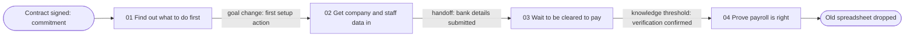

# Synthesis to stages

Method for turning raw research material into findings, evidence rows, and a stage model that the actor would recognize. Use it in workflow step 6 (Synthesize) and whenever a CJM/EJM needs stages derived from evidence rather than from an org chart.

## Which analysis method this is

This is **codebook thematic analysis**, close to **template analysis** (Brooks, McCluskey, Turley & King 2015): a structured codebook is built early from a subset of the data, applied to the rest, and revised in documented versions. Clusters are formed by affinity diagramming. It is chosen because journey work needs claims that a second analyst can audit and that stay traceable to sources.

It is not reflexive thematic analysis in the sense Braun & Clarke describe (2006; 2021). Reflexive TA treats themes as the analyst's interpretive construction and rejects inter-coder agreement as a quality measure. If a team works reflexively, it drops the agreement checks below, documents the analyst's position instead, and marks stage claims no stronger than `inferred`.

## Inputs and outputs

Inputs: transcripts, field notes, diary entries, test recordings, support-log extracts, analytics queries, operational records. Each source needs a stable reference (session code, query name, export date). Handle raw material under `research-ethics.md`.

Outputs:

1. observation notes (working material, not a register);
2. a versioned codebook;
3. clusters with provenance;
4. findings, each written as a claim with `evidence_status`;
5. evidence register rows (evidence IDs);
6. a stage model: stage-level node rows (L3) with `actor_goal`, entry and exit conditions, `evidence_ids`, `evidence_status`;
7. contradictions, variants, and unknowns.

## Terms: source and source type

- **Independent source:** for qualitative claims, a distinct participant (two sessions with the same person are one source); for quantitative claims, a distinct dataset or system of record (two queries on the same table are one source).
- **Source type:** the `source_type` of the evidence (interview, analytics, support-log, …). Types are for triangulation: agreement across types guards against one method's bias. Counting sources answers "how many"; counting types answers "seen by how many methods".
- A single cited source can support `observed` for what it directly shows, scoped to that source ("this admin polled the page"). What one source cannot do is establish a pattern across actors.

## Step 1 — Unitize

Break each source into observation notes. One note holds one observation.

- One note = one thing the actor did, said, expected, or felt, or one measured fact. If a note contains "and", check whether it is two notes.
- Each note carries a working key `{source}-{seq}`: `S03-04` (session 3, note 4), `AN-02` (analytics query 2). Working keys are local to the synthesis, not ontology IDs; they end up in `source_reference` of evidence rows.
- Record the note type: `did`, `said`, `expected`, `felt`, `measured`, `workaround`. Behavior (`did`, `workaround`, `measured`) and attitude (`said`, `expected`, `felt`) stay separate.
- Stay close to the source. Interpretation does not belong in the note.
- Record the context the note depends on: segment, role, channel, time since trigger.
- Tag statements about the organization's intent from staff as `stakeholder-input`.

Failure modes: notes that summarize a whole interview; notes in the analyst's vocabulary ("user had onboarding friction"); dropping the source key to tidy the board.

## Step 2 — Build and apply the codebook

Two code levels. Do not merge them.

**Descriptive codes** label what a note is about in words close to the data: "waits for email after purchase", "keeps old spreadsheet".

**Interpretive codes** label what a pattern means for the actor's progress: "no signal of what to do first", "needs proof before trusting". Each interpretive code lists the descriptive codes it rests on. An interpretive code with no descriptive support is a hypothesis.

Procedure:

1. Two analysts code the same 2–3 sources independently and draft codebook v1: code name, definition, include/exclude rule, one example note.
2. Compare. Where they disagree, return to the note and sharpen the include/exclude rule; do not settle by vote. Record the percentage of notes coded the same way as a check on codebook clarity, not as proof of truth.
3. Apply v1 to the remaining sources. Add or split codes only by a new codebook version with a one-line reason.
4. Re-code the first sources with the final version.

## Step 3 — Cluster with provenance

Group notes by interpretive code into clusters (affinity diagramming). Keep note keys visible on every cluster.

- Build bottom-up. Column headers taken from the org chart or a generic lifecycle pre-decide the stage model.
- Name each cluster with a sentence in the actor's voice ("I don't know what to do first"), not a noun ("Orientation").
- Record for each cluster: note keys, number of distinct sources, number of distinct source types, segments represented.
- A cluster supported by one independent source is a lead: its notes stay `observed` for that source, but it does not establish a pattern. Keep it and mark it.
- If a note genuinely supports two clusters, duplicate it with the same key; do not rewrite it.
- Clusters about channels ("uses phone", "uses web") are usually attributes of other clusters.

## Step 4 — Detect progression boundaries

A stage boundary is a point where the actor's situation changes in a way the actor would notice. Walk each participant's notes in time order and mark candidate boundaries.

| Boundary signal | Test question | Example |
|---|---|---|
| Goal change | Is the actor now trying to achieve something different? | From "choose a provider" to "get it working" |
| Commitment point | Has the actor made a decision that is costly to reverse? | Signed, paid, submitted, resigned |
| Waiting or handoff | Does progress now depend on someone else, and does the actor experience that as a distinct period? | Waiting for approval, a manager, a delivery |
| Knowledge threshold | Does the actor now know or believe something that changes what they do next? | "Now I trust the numbers" |
| Outcome reached or lost | Has the actor achieved, or given up on, a sub-outcome? | First successful use; abandonment |

Not a boundary on its own:

- **Channel change.** Phone, then web, then email with the same goal is one stage with channel switches.
- **Department change.** A backstage handoff becomes a boundary only if the actor experiences it as a wait or a new goal.
- **System or screen change.**
- **Calendar interval** ("week 1"), unless the actor organizes the experience around it (pay cycles, school terms).

Mark a boundary as candidate when at least two participants, or one participant plus one non-interview source, show it. Record which signal it is.

## Step 5 — Test candidate stages

A span between two boundaries is a candidate stage (L3). Keep it only if it passes all four tests:

1. **Recognition.** The actor would recognize it in their own words. Check against transcripts or by reading it back to participants.
2. **Own goal.** Its actor goal differs from the neighboring stages.
3. **Exit condition.** An observable condition ends it, stated from the actor's side ("staff are in the system"), not the service's ("ticket closed").
4. **Not a department or channel.** Renaming it after the team or channel that serves it would lose meaning. If not, it is an internal process step.

Decision rules:

- Status follows the stage rule in step 9. A span with no observed evidence at all is a missing-evidence area: keep it only as `hypothesis`.
- A span inside which the goal does not change is an episode or step (L4) of a neighboring stage.
- If one cluster spans two candidate stages without a change of goal, the boundary between them is probably false.
- Target 3–7 stages for an L2 journey. Fewer suggests the scope is a single stage; more suggests steps promoted to stages.
- Loops and retries are nonlinearity inside a stage, not new stages.

## Step 6 — Contradictions and segments

Do not average disagreements. Classify them:

| Pattern | Decision |
|---|---|
| Different desired outcome for an identifiable group | Split: separate journey (and actor if needed) |
| Same outcome, different stage order | Split into separate journeys, or model the order difference as branches of one journey if the stages are the same |
| Same outcome and order, different friction, effort, or duration | Variant: one stage model with a variant note naming the variable (for example, "setup done by external accountant") |
| Same group, conflicting statements | Check behavior vs attitude; behavior for what happened, attitude for how it felt; record both |
| One source contradicts many | Keep it as an outlier with its context |
| Cannot explain | Register an `unknown` evidence row stating the open question and the evidence that would resolve it |

## Step 7 — Saturation and sample honesty

- Track new codes per session. When the last two or three sessions in a segment add no new interpretive codes, report "no new codes in the last N sessions", not "saturated". Guest, Bunce & Johnson (2006) found most codes in relatively homogeneous groups within about twelve interviews; that describes their study, not a quota.
- Saturation is per segment. Five interviews across five segments is one per segment.
- Qualitative counts ("4 of 6 participants") describe the sample, never the population. Do not convert them to percentages.
- Prevalence needs a quantitative source with a stated denominator. Pair each qualitative finding with the check that would size it, or register prevalence as `unknown`.
- State recruitment bias: who was reachable, who declined, who was excluded.

## Step 8 — Write findings as claims

Use the claim pattern from `evidence-model.md`:

`[Actor] in [context] tends to [behavior/experience] because [supported explanation], affecting [outcome].`

Status of a finding follows its weakest necessary part:

| Status | Use when |
|---|---|
| `observed` | The behavior, statement, or measurement appears directly in the cited sources — one source is enough for what it directly shows; any "because" clause is also stated by actors or omitted |
| `inferred` | The pattern is observed, but the explanation is the analyst's reasoning; write the reasoning in one line |
| `hypothesis` | Stakeholder input only, an interpretive code without descriptive support, or a generalization beyond what the cited sources show |
| `unknown` | Material question the evidence cannot answer; registered as an evidence row whose `finding` states the question |

Register one evidence row per finding per source type, so `source_type` stays single-valued and triangulation shows as several rows supporting one claim.

## Step 9 — Assign status to stages

A stage is a claim about structure (where progress changes), not only about behavior. The same rule appears in the customer- and employee-journey-mapping skills:

> A stage (L3) is `observed` only when its goal and boundaries are supported by at least two clusters, or by one cluster that draws on at least two independent source types; a stage resting on one cluster from a single source type is at most `inferred`; a stage with no observed evidence is `hypothesis`. A stage is never stronger than its weakest defining finding. Episodes (L4) use a lighter rule: an episode is `observed` when at least one observed finding directly shows its actions, start, and end; otherwise it takes the status of its best supporting finding.

For an `inferred` stage, cite the observed evidence and state the reasoning that places its boundaries.

## Step 10 — Emit the stage model

For each surviving stage record: node ID, name (verb phrase in actor terms), `actor_goal`, entry signal, exit condition, `evidence_ids`, `evidence_status`, variants. Channel switches, loops, and backstage handoffs are attributes or L4 children, not stages.

## Worked mini-example

Fictional scenario. Journey `JRN-CUST-PAYROLL-START-001`, "Start paying staff with the new payroll service"; actor `ACT-CUST-PAYROLL-ADMIN-01` (office admin at a small business). Sources: five interviews (S01–S05), one analytics query (AN), one support-log extract joined to account records (SL).

### Observation notes

| Key | Type | Note |
|---|---|---|
| S01-02 | said | "Signed on Friday. Monday I had no idea what to do first, so I waited for someone to email me." |
| S02-01 | did | Searched help center for "import employees" before any kickoff contact arrived. |
| AN-01 | measured | Q2 contract cohort (n=1,840 accounts): median 9 days from contract to first employee import; 31% of accounts with no activity in the first 5 days. |
| S03-05 | did | Needed owner's sign-off to submit bank details; submission waited 6 days. |
| S03-02 | did | External accountant, not the admin, entered company data. |
| S04-03 | said | "The bank verification — I just kept refreshing the page. Nobody told me anything." |
| SL-01 | measured | Q2 contract cohort: 31 contacts about verification status per 100 new accounts in their first 30 days. |
| S01-06 | expected | "I wasn't going to run real payroll until I'd seen a test payslip." |
| S04-05 | workaround | Ran the old spreadsheet in parallel for the first two pay cycles. |
| S05-04 | said | "After the first payroll came out right, I stopped checking the spreadsheet." |
| S02-04 | did | Kickoff by phone, import on web, bank documents by email — same goal throughout. |
| S05-01 | said | "Onboarding was fast." (Accountant had pre-filled company data.) |

### Clusters

| Cluster (actor voice) | Notes | Sources / types |
|---|---|---|
| C1 "I don't know what to do first" | S01-02, S02-01, AN-01 | 3 / interview, analytics |
| C2 "I need other people's data and sign-off" | S03-05, S03-02, S05-01 | 2 / interview |
| C3 "I can't tell if the bank is approved" | S04-03, SL-01 | 2 / interview, support-log |
| C4 "I won't trust it until I've seen it work" | S01-06, S04-05, S05-04 | 3 / interview |

S02-04 is a channel switch inside stage 02, not a cluster. S05-01 seems to contradict C1–C2 difficulty; its context (accountant pre-filled data) makes it a variant.

### Boundaries and stages

| node_id | name | actor_goal | exit condition | evidence_ids | evidence_status |
|---|---|---|---|---|---|
| NOD-CUST-PAYROLL-START-001-01 | Find out what to do first | Know the first step after buying | First setup action started | EVD-2025-0501;EVD-2025-0502 | observed |
| NOD-CUST-PAYROLL-START-001-02 | Get company and staff data in | Have company, staff, and bank data entered | Bank details submitted | EVD-2025-0503 | inferred |
| NOD-CUST-PAYROLL-START-001-03 | Wait to be cleared to pay | Know that money can move | Admin sees verification confirmed | EVD-2025-0504;EVD-2025-0505 | observed |
| NOD-CUST-PAYROLL-START-001-04 | Prove payroll is right | Trust the service enough to drop the old method | Old spreadsheet no longer checked | EVD-2025-0506 | inferred |

Stages 01 and 03 are `observed`: each rests on one cluster that draws on two independent source types (C1: interviews and analytics; C3: interview and support log). Stages 02 and 04 are `inferred`: each rests on one cluster of interviews only, so the behavior is observed but the boundary placement is the analyst's reasoning — for stage 04, "the parallel run ends when admins stop checking the spreadsheet (S04-05, S05-04); the exit is placed at that point". To raise them, add a second source type (for example, spreadsheet-export events or first-run correction data) or read the model back to three to five admins.

Evidence rows (abridged):

| evidence_id | source_type | source_reference | finding | evidence_status |
|---|---|---|---|---|
| EVD-2025-0501 | interview | S01-02;S02-01 | Admins do not receive a clear first step after purchase and wait or self-search | observed |
| EVD-2025-0502 | analytics | AN-01 | Median 9 days contract to first import; 31% of accounts inactive in first 5 days (Q2 cohort, n=1,840) | observed |
| EVD-2025-0503 | interview | S03-05;S03-02;S05-01 | Setup pace depends on owner or accountant availability | observed |
| EVD-2025-0504 | interview | S04-03 | Admin cannot see verification progress and polls the page | observed |
| EVD-2025-0505 | support-log | SL-01 | 31 verification-status contacts per 100 new accounts in first 30 days (Q2 cohort) | observed |
| EVD-2025-0506 | interview | S01-06;S04-05;S05-04 | Admins run the old method in parallel until one correct payroll | observed |
| EVD-2025-0507 | analytics | AN-01 (not yet segmented) | Does first-5-day inactivity differ for accountant-led accounts? | unknown |

Checks applied:

- Stage 03 is a waiting stage and passes the tests: admins name it, it has its own goal, and its exit is visible to them.
- The phone/web/email switch in stage 02 did not create stages.
- Stage 02 has a variant, "setup done by external accountant" (S03, S05): same goal and order, shorter duration.
- The claim "admins keep the spreadsheet because they lack a test payslip" is `inferred`: the parallel run is observed; the cause is stated by one participant only.
- Five interviews, one segment dominant; counts are not prevalence. Prevalence figures come from AN-01 and SL-01 with their denominators.

## Quality checks before hand-off

- Codebook version and change log are attached.
- Every stage cites evidence IDs; every evidence ID resolves to note keys and sources.
- No stage is named after a team, system, or channel; each has an actor goal and an actor-side exit.
- Contradictions carry a split/variant/unknown decision.
- Qualitative counts are not written as percentages; every rate states its denominator.
- No stage status is stronger than step 9 allows.

## Sources

- Virginia Braun & Victoria Clarke, "Using thematic analysis in psychology", *Qualitative Research in Psychology* 3(2), 2006.
- Virginia Braun & Victoria Clarke, "One size fits all? What counts as quality practice in (reflexive) thematic analysis?", *Qualitative Research in Psychology* 18(3), 2021.
- J. Brooks, S. McCluskey, E. Turley, N. King, "The utility of template analysis in qualitative psychology research", *Qualitative Research in Psychology* 12(2), 2015.
- Greg Guest, Arwen Bunce, Laura Johnson, "How many interviews are enough?", *Field Methods* 18(1), 2006.
- Nielsen Norman Group: Maria Rosala on thematic analysis; Rachel Krause & Kara Pernice on affinity diagramming.
- Indi Young, *Mental Models* and *Practical Empathy*; Steve Portigal, *Interviewing Users*; Kerry Bodine on mapping journey variations.
