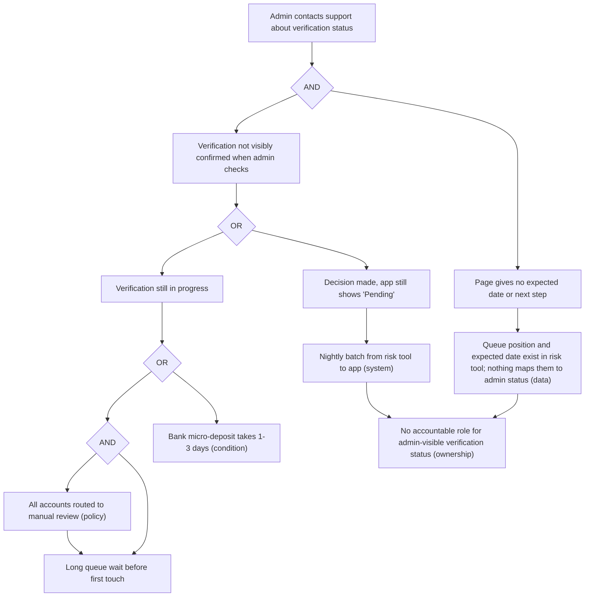

# Root-cause analysis on a blueprint

Method for moving from a symptom the actor can see to causes the organization can change, with every causal link either evidenced or labeled as a hypothesis. Use it in workflow steps 9–11 (failure points, metrics, opportunities) and whenever a blueprint must answer "why does this keep happening?".

The method combines cause-and-effect branching (Ishikawa), fault-tree gate logic (Vesely et al., *Fault Tree Handbook*), and the systems view of error (Dekker), applied to blueprint layers.

## Output

A causal tree per symptom, a link table, and one opportunity row per root cause.

Link table:

| effect | cause | layer | cause type | evidence_ids | evidence_status | test applied | owner |
|---|---|---|---|---|---|---|---|

`cause type` is `root`, `contributing`, or `condition`. In the opportunity register (the journey-architecture skill's ontology), `problem` holds the symptom, `root_cause` the cause, and `root_cause_status` the status of the weakest link on the path between them (step 4).

## Step 1 — State the symptom

`[Actor] at [node] [observable symptom], [rate with denominator], [period], evidence [evidence IDs].`

- Actor-visible, not internal: "admins contact support to ask whether bank verification is approved", not "verification backlog".
- One symptom per analysis. "Slow and confusing onboarding" is two.
- Size it with a denominator tied to the population at risk ("contacts per 100 new accounts"), not a share of another moving total ("% of tickets").
- Note where the symptom does not occur, if known. That is the comparison set for step 6.
- If the symptom itself is not evidenced, stop and route to `journey-research`.

## Step 2 — Walk down the layers

For each link ask "what, one layer down, makes this happen?":

| Layer | Question |
|---|---|
| Frontstage | What does the actor see, or not see, here? |
| Backstage | What work produces or fails to produce that frontstage state? |
| Support process | Which queue, team, or partner process does that work depend on? |
| Policy / rule | Which rule forces the process to work this way? For whom was it written? |
| Data | What data is created, where, and who consumes it? Does anyone consume the state the actor needs? |
| System | Which sync, batch, integration, or automation moves or blocks that data? |
| Ownership | Who is accountable for the outcome at this link? Does anyone own the end-to-end state? |

Skipping a layer is allowed; skipping it silently is not. Write "no link found at policy layer" so reviewers see it was checked.

Stop descending when the next cause is outside the organization's control (record it as a `condition`) or when you reach a changeable cause that is not itself explained by a deeper changeable cause in scope.

## Step 3 — Branch; do not run a single chain

Naive 5-whys fails in predictable ways (Card 2017):

- **Single chain.** One answer per "why" drops parallel causes.
- **Arbitrary depth.** The fifth why is not privileged; the useful intervention may be at the second.
- **Stopping at people.** "Agent did not update the case" ends at blame. Ask what made that action reasonable at the time: workload, tool design, conflicting instruction (Dekker).
- **Unverified links.** Each answer is plausible; none is checked.
- **Analyst's domain.** The chain follows what the analyst knows.

At each node, generate candidates across categories before choosing: people and roles, process and queue, policy and rule, data, system and automation, partner, environment. Then state how causes combine:

- **OR gate:** any one input is enough to produce the effect. Each input needs its own fix.
- **AND gate:** the effect occurs only when all inputs hold. Removing any one prevents it; pick the cheapest reliable one.

Check every gate: for an AND, confirm the inputs can hold at the same time and that removing one really prevents the effect; for an OR, confirm each input alone produces it.

## Step 4 — Verify each link

Each edge in the tree is a claim with its own `evidence_status`:

| Status | The link is… |
|---|---|
| `observed` | Shown by a mechanism trace in records, an experiment, or a counterfactual comparison that meets step 6 |
| `inferred` | Supported by observed facts plus stated reasoning, including correlation, dose/variation, or timing alone |
| `hypothesis` | Plausible and unchecked; typical of workshop output and all stakeholder input |
| `unknown` | Material link with no evidence and no plausible candidate |

- A root cause's status is set per path, not per link: it equals the weakest link on its path to the symptom, including links above it in the tree. A root with an `observed` first link that reaches the symptom through an `inferred` link is `inferred`. If a root reaches the symptom by several paths, give each path's status and report the strongest as `root_cause_status`, naming the path.
- Keep two questions apart: "does the cause exist?" (often `observed` from a document or configuration) and "does it produce the symptom?" (the path status). Only the second goes into `root_cause_status`.
- Stakeholder statements about their own process ("we always update within an hour") support `hypothesis` until checked against records.
- Prefer evidence from the layer itself: policy text for policy links, configuration or logs for system links, timestamps for queue links.
- Each `hypothesis` link names its check: which record, who holds it, what result would falsify it.

## Step 5 — Root, contributing, condition

- **Root cause:** a node in the tree that (1) the organization can change, (2) has no child node that is itself a changeable cause in scope — it is a leaf of the changeable part of the tree, and (3) when removed, is expected to prevent or substantially reduce the symptom through its path. Any node with a changeable cause below it is not a root, however important.
- **Contributing cause:** a changeable node with a deeper changeable cause below it, or one whose removal alone would not stop the symptom. Contributing causes are often worth fixing; they are still not roots.
- **Condition:** true and relevant but outside control (regulation, a third party's timelines). Design around it.

Service symptoms usually have several root causes. Report all that survive step 6, ranked by share of the symptom explained and cost to change.

## Step 6 — Test the cause

| Test | What it shows | Maximum status |
|---|---|---|
| Mechanism trace | Individual cases followed through records from cause to effect | `observed` for the traced mechanism |
| Experiment | Randomized or alternating assignment of the cause | `observed` |
| Stratified counterfactual | Cause absent vs present in comparable groups, same period, stratified on known confounders, with pre-period parity checked | `observed`, limited to the strata compared |
| Dose / variation | Effect rises with the intensity of the cause | `inferred` |
| Timing | Effect changed when the cause changed | `inferred` |
| Unstratified or self-selected comparison | Groups differ in more than the cause | `inferred` |

Decision rules:

- Symptom present where the cause is absent: the cause is at most contributing; look for another branch.
- Cause present, symptom absent in a group: look for a protective factor; it is often the design lever.
- A test supports only the link it measures. Evidence that long waits produce contacts says nothing about why waits are long.
- No comparison set: propose the smallest experiment that would create one.

## Step 7 — Check common root-cause families

| Family | Signature | Question |
|---|---|---|
| Ownership gap | Every team owns a step; no one owns the actor's end-to-end state | Who is accountable if the actor never finds out? |
| Policy written for the exception | A rule designed for a rare risky case applied to everyone | What share of cases does the rule actually protect against? |
| Data created without its consumer | A system records the state; nothing surfaces it where the actor or agent needs it | Who reads this field, and when? |
| Status invisibility | Work progresses but the actor cannot see it, so they ask | What would the actor need to see to stop asking? |
| Queue design | FIFO without aging, batch windows, unlimited work in progress, no priority for blocked actors | How long do items wait versus being worked? |
| Incentive conflict | A team metric rewards behavior that harms the actor | What is the team measured on at this step? |
| Brittle automation | Exceptions drop into a manual path nobody monitors | Where do automation failures go, and who sees them? |
| Handoff loss | Information re-entered or summarized between teams | What is lost between sending and receiving record? |

## Step 8 — Write it up

One link-table row per edge; one opportunity per root cause (not per symptom). Attach operational metrics to the layer where the cause lives (queue wait at the support-process layer, not only contact rate at the actor row).

## Worked example

Fictional scenario shared with the journey-research and journey-metrics methods. Journey `JRN-CUST-PAYROLL-START-001`, "Start paying staff with the new payroll service"; stage `NOD-CUST-PAYROLL-START-001-03`, "Wait to be cleared to pay", registered as trust moment `MTM-0501`.

Symptom: admins at stage 03 contact support to ask whether bank verification is approved — 31 contacts per 100 new accounts in their first 30 days, Q2 contract cohort (metric `MET-0507`); evidence EVD-2025-0504, EVD-2025-0505.

Evidence used:

| evidence_id | source_type | finding | evidence_status |
|---|---|---|---|
| EVD-2025-0504 | interview | Admin cannot see verification progress and polls the page | observed |
| EVD-2025-0505 | support-log | 31 verification-status contacts per 100 new accounts, first 30 days, Q2 cohort | observed |
| EVD-2025-0511 | operational-record | 20 traced cases: risk decisions reach the app via a nightly batch; lag median 14 h, p90 22 h | observed |
| EVD-2025-0512 | document | Manual-review policy lists high-risk criteria, but its scope clause covers all new accounts | observed |
| EVD-2025-0513 | operational-record | 20 traced cases: 85% of verification elapsed time is queue wait before first touch; queue worked FIFO | observed |
| EVD-2025-0514 | stakeholder-input | Onboarding and risk leads each say the other owns admin-facing verification status | hypothesis |
| EVD-2025-0515 | document | Bank micro-deposit confirmation takes 1–3 business days (bank terms) | observed |
| EVD-2025-0516 | operational-record | Low-risk accounts only, same weeks: two regions on auto-path vs other regions on manual review, stratified by setup variant; pre-pilot contact rates 30 vs 31 per 100; during pilot, median verification 0.5 vs 4.0 days and contacts 5 vs 29 per 100 | observed |
| EVD-2025-0517 | analytics | Contacts per 100 accounts by verification duration band: 9 (≤2 days) to 41 (≥5 days), in both setup variants | observed |
| EVD-2025-0518 | document | Status page shows "Pending" with no expected date or next step (app configuration and screenshots in 5/5 sessions) | observed |

Causal tree:

Gate checks: the top AND holds because an admin who sees a confirmed status does not ask, and one who sees a credible date and next step is expected to wait until that date (the second half is itself `inferred` from EVD-2025-0504 and must be tested). The inner AND holds because auto-path accounts skip the queue, and manual review without queue wait takes under an hour (EVD-2025-0513). A1a also feeds A1b: routing every account to manual review is what fills the queue.

Link table:

| effect | cause | layer | cause type | evidence_ids | evidence_status | test applied | owner |
|---|---|---|---|---|---|---|---|
| S | A and B together | frontstage | — | EVD-2025-0504;EVD-2025-0517;EVD-2025-0518 | inferred | dose/variation for A; interview for B | Product, onboarding app |
| A1 | A1a all accounts to manual review | policy | root (leaf: scope clause written for high-risk accounts, applied to all) | EVD-2025-0512;EVD-2025-0516 | observed for this link (low-risk band only) | stratified counterfactual with pre-period parity | Risk policy owner |
| A1 | A1b queue wait before first touch | support process | contributing (explained by A1a plus staffing) | EVD-2025-0513 | observed | mechanism trace | Risk operations lead |
| A1b tail (p90) | FIFO with no aging alert | support process | contributing | EVD-2025-0513 | inferred | queue order observed; tail attribution reasoned | Risk operations lead |
| A2 | A2a nightly batch | system | contributing | EVD-2025-0511 | observed | mechanism trace | Platform team |
| B | B1 data without its consumer | data | contributing (explained by O) | EVD-2025-0513;EVD-2025-0518 | inferred | data exists in risk tool, absent in app config; absence of consumer reasoned from data map | none assigned |
| B1, A2a | O no accountable role for admin-visible status | ownership | root | EVD-2025-0514 | hypothesis | check: RACI review with onboarding and risk leads | Journey owner (to assign) |
| A1 | C bank confirmation time | partner | condition | EVD-2025-0515 | observed | document | — |

Root status by path:

| root | path to symptom | weakest link | root_cause_status |
|---|---|---|---|
| A1a | A1a → A1 (observed, low-risk band) → A (by definition) → S (inferred) | A → S | inferred |
| O | O → B1 (hypothesis) → B (inferred) → S (inferred) | O → B1 | hypothesis |
| O | O → A2a (hypothesis) → A2 (observed) → A (by definition) → S (inferred) | O → A2a | hypothesis |

Reading it:

- The dose/variation evidence (EVD-2025-0517) supports only "longer waits → more contacts". It says nothing about why waits are long; that link rests on the mechanism trace and the pilot.
- The pilot regions were not randomly chosen, so the comparison is limited to low-risk accounts, stratified by setup variant, and checked for pre-pilot parity. It says nothing about higher-risk bands.
- Fixing only the policy leaves the "Pending with no date" branch for the accounts that still need review. Fixing only the page leaves admins waiting four days, knowingly.
- "Support did not proactively tell admins" was examined and rejected as a cause: agents had no view of the risk tool, so their behavior was reasonable given their tools. It points back to B1 and, below it, to O.

Opportunity rows (abridged):

| opportunity_id | node_id | moment_ids | metric_ids | problem | root_cause | root_cause_status | evidence_ids | evidence_status |
|---|---|---|---|---|---|---|---|---|
| OPP-0501 | NOD-CUST-PAYROLL-START-001-03 | MTM-0501 | MET-0503;MET-0507 | Admins wait days to be cleared to pay and ask support | Manual-review scope covers all accounts, not only high-risk | inferred | EVD-2025-0505;EVD-2025-0512;EVD-2025-0516;EVD-2025-0517 | observed |
| OPP-0502 | NOD-CUST-PAYROLL-START-001-03 | MTM-0501 | MET-0506;MET-0507 | Admins cannot see progress, an expected date, or a timely decision | No accountable role for admin-visible verification status (contributing: progress data has no admin-facing consumer; nightly batch) | hypothesis | EVD-2025-0504;EVD-2025-0505;EVD-2025-0514;EVD-2025-0518 | observed |

## Quality checks

- Symptom is actor-visible, sized with a stable denominator, and evidenced.
- The tree branches; at least two categories were considered at every node; every gate passes its check.
- No chain ends at a person's mistake without asking what made the action reasonable.
- Every edge carries `evidence_status`; each root's status is the weakest link on its path to the symptom; dose and timing never exceed `inferred`.
- Each test is applied to the link it measures, not to neighboring links.
- Conditions are separated from root causes; each root cause has an owner or an explicit "no owner" finding.

## Sources

- ASQ, "What is a fishbone diagram?" (Ishikawa cause-and-effect diagram).
- W. E. Vesely, F. F. Goldberg, N. H. Roberts, D. F. Haasl, *Fault Tree Handbook*, NUREG-0492, U.S. Nuclear Regulatory Commission, 1981.
- Alan J. Card, "The problem with '5 whys'", *BMJ Quality & Safety*, 2017.
- Sidney Dekker, *The Field Guide to Understanding 'Human Error'*, 3rd edition, 2014.
- G. Lynn Shostack, "Designing Services That Deliver", *Harvard Business Review*, 1984; Mary Jo Bitner, Amy L. Ostrom, Felicia N. Morgan, "Service Blueprinting: A Practical Technique for Service Innovation", *California Management Review* 50(3), 2008.
